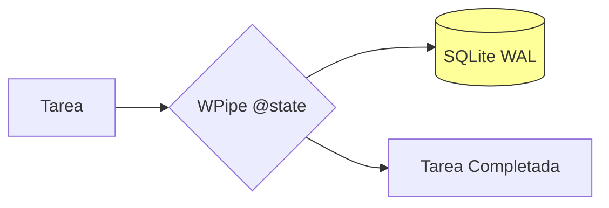

# 🔌 ¿Dices adiós al Broker? WPipe vs. Celery

¿Cansado de configurar Redis o RabbitMQ solo para correr tareas asíncronas? 🐰 

Celery es potente, pero su arquitectura requiere un "Broker" externo que añade latencia y complejidad operativa. **WPipe** revoluciona la ejecución de tareas con un enfoque "Broker-less" gracias a su motor de persistencia SQLite WAL.

### ⚔️ Battle Card: WPipe vs. Celery

| Feature | WPipe | Celery |
| :--- | :---: | :---: |
| **Infraestructura** | **Zero-Infra (Puro Python)** | Broker (Redis/RabbitMQ) |
| **RAM Usage** | **< 50MB** | > 200MB |
| **Resiliencia** | Nativa (SQLite WAL) | Dependiente del Broker |
| **Setup Time** | < 1 minuto | Horas |

### 🛠️ Código Limpio y Directo

Olvídate de configurar aplicaciones Celery pesadas. Con WPipe, tu lógica `@state` es todo lo que necesitas.

```python
from wpipe import state, to_obj

@state(name="AsyncTask", version="v1.0")
@to_obj
def send_email(user_data: dict):
    # Procesa tu tarea sin broker externo
    return {"sent": True, "user": user_data['email']}
```

### 📊 Flujo sin Intermediarios



Con **+117k instalaciones**, WPipe demuestra que la eficiencia es el camino. ¿Por qué complicarse con brokers si puedes tener resiliencia nativa? 🚀

#Python #Celery #WPipe #Async #WebDev #Backend #ZeroInfra
