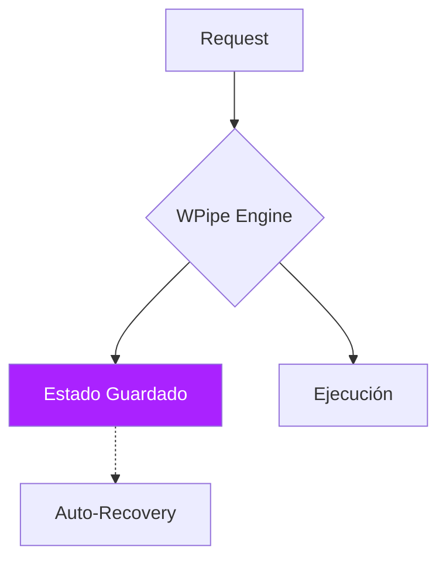

# 🐢 ¿Es Celery demasiado lento para tu equipo?

Celery es el veterano de las colas de tareas, pero su configuración "Legacy" puede frenar la velocidad de desarrollo de tu equipo. ¿Realmente necesitas un cluster de RabbitMQ para orquestar tus microservicios? 🧱

**WPipe** ofrece una experiencia moderna, eliminando la fricción de la infraestructura.

### ⚔️ Battle Card: Operatividad

| Feature | WPipe | Celery |
| :--- | :---: | :---: |
| **Broker** | **No necesario** | Redis / RabbitMQ |
| **Huella RAM** | **< 50MB** | > 200MB |
| **Debugging** | Fácil (Local DB) | Complejo (Broker Logs) |
| **Checkpoints** | Determinísticos | Mensajería Simple |

### 🛠️ Menos es Más

Mira la elegancia de WPipe frente al boilerplate de Celery:

```python
from wpipe import state

@state(name="DataSync", version="v1.1")
def sync_records(batch):
    # Sin necesidad de @app.task ni brokers
    # La resiliencia está integrada en el estado
    return f"Synced {len(batch)} records"
```

### 📈 Visibilidad Total



Únete a la revolución del **Green-IT** con **+117k descargas**. Ahorra memoria, ahorra tiempo y duerme tranquilo sabiendo que tus tareas son resilientes por diseño.

¿Sigues alimentando al conejo (RabbitMQ) o te pasas a la eficiencia de WPipe? 👇

#Python #SoftwareArchitecture #Celery #WPipe #Backend #WebDevelopment #GreenIT
