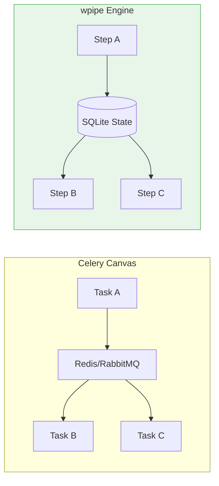

# Scaling Task Graphs: Why wpipe is the Lightweight Alternative to Celery Canvas

*Subtitle: Orchestrating complex task dependencies without the overhead of RabbitMQ, Redis, or Distributed Workers.*

---

If you've ever had to build a complex workflow in Python involving multiple dependent tasks, you've likely looked at **Celery**. Specifically, you've looked at **Celery Canvas** — the set of tools (groups, chains, chords, chunks) designed to handle task orchestration.

Celery is an industry titan. It’s the go-to solution for distributed task queues. But when it comes to *orchestration* — managing the logic, state, and flow between tasks — Celery often introduces more problems than it solves for medium-scale projects.

This is where **wpipe** offers a fundamentally different, and often superior, architectural path.

## The Hidden Cost of Celery

Celery was built to solve a specific problem: **Asynchronous Background Tasks**. It excels at taking a task, throwing it into a queue (RabbitMQ/Redis), and having a worker pick it up whenever it can.

However, when you try to use it for *Pipelines*, the "Infrastructure Tax" starts to bite:

1. **Broker Dependency:** You cannot run Celery without a message broker. This means maintaining a Redis or RabbitMQ instance, managing its memory, monitoring its uptime, and handling its connection strings.
2. **State Blindness:** Celery workers are essentially stateless. Once a task is "fired and forgotten," tracking its specific input/output and how it relates to the *next* task requires external database logic or complex Canvas chaining.
3. **The "Canvas" Complexity:** Anyone who has written a complex `chord` or `group` in Celery knows that debugging them is a nightmare. If a task in the middle of a `chain` fails, the entire state of that chain becomes a "distributed mystery."

## wpipe: Orchestration Without the Broker

**wpipe** approaches the problem from the perspective of **Stateful Orchestration**. Instead of a queue, it uses a **Pipeline Engine** backed by a local, highly-optimized SQLite WAL database.

### 1. State-Aware by Design
In Celery, passing data between tasks in a chain is clunky. In **wpipe**, there is a unified `data` dictionary that travels through the pipeline. Every step reads from it and writes to it. 
*   **Result:** You have a clear, traceable "thread of truth" that isn't scattered across distributed workers.

### 2. Zero Infrastructure (The Green-IT Path)
wpipe doesn't need Redis. It doesn't need RabbitMQ. It runs as a part of your Python process or as a lightweight microservice.
*   **RAM Footprint:** While a Celery + Redis stack can easily consume 500MB+ just idling, wpipe operates in **less than 50MB**. For developers running tasks on small VPS, Raspberry Pi, or Edge devices, this difference is transformative.

### 3. Checkpoints: The "Save Game" for Tasks
This is the feature that Celery simply doesn't have. If a Celery worker dies in the middle of a long-running task chain, the state is often lost or left in an inconsistent "In Progress" status.

wpipe implements **SQLite Checkpoints**. After every successful step in your graph, the state is persisted. If your system reboots, wpipe picks up the pipeline and resumes it from the exact point of failure.

## The "Battle Card": wpipe vs. Celery

| Feature | Celery | wpipe |
| :--- | :--- | :--- |
| **Broker** | Required (Redis/RabbitMQ) | **None (SQLite Native)** |
| **Logic** | Distributed Tasks | **Structured Pipelines** |
| **State** | Stateless / Transient | **Stateful (Checkpoints)** |
| **Complexity** | High (Canvas logic) | **Low (Pythonic/YAML)** |
| **Observability** | Requires Flower/Logs | **Built-in (SQLite Tracker)** |
| **Resources** | Heavy | **Ultra-lightweight (<50MB)** |

## Conclusion: When to Choose wpipe?

If you are building a system that needs to handle 100,000 independent, short-lived tasks per second across 20 servers, stay with **Celery**. It’s a beast of a distributed queue.

But if you are building **orchestrated workflows** — where the order of operations, the state between steps, and the ability to resume after a failure are more important than sheer distributed volume — **wpipe** is the modern, lightweight, and sane choice.

Stop managing brokers. Start managing logic.

---

**Master your task graphs with wpipe:**
⭐ [GitHub Repository](https://github.com/your-repo/wpipe)

#Python #Backend #Celery #Microservices #SoftwareArchitecture #wpipe #Automation
