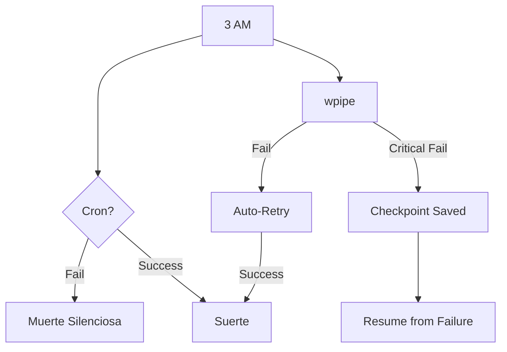

# 🕒 ¿Sigues confiando tu negocio a un archivo crontab? Es hora de despertar.

Todos amamos **Cron**. Es simple, es nativo y lleva décadas funcionando. Pero en la ingeniería moderna, la "simplicidad" de Cron es un riesgo de seguridad y fiabilidad. 

Si tu tarea de Cron falla a las 3 AM:
❌ No hay reintentos automáticos.
❌ No hay seguimiento de qué datos se perdieron.
❌ No hay forma de reanudar desde el punto de fallo.

Es hora de profesionalizar tus tareas programadas con **wpipe**.

### ⚔️ La Evolución: Cron vs. wpipe

| Desafío | Cron (Legacy) | wpipe (Modern) |
| :--- | :--- | :--- |
| **Visibilidad** | Silent Failures | **Forense (SQL Tracker)** |
| **Resiliencia** | Empieza de cero | **Checkpoints (Save Game)** |
| **Complejidad** | Scripts frágiles | **Código modular (@step)** |
| **Alertas** | Logs de sistema opacos | **Integración nativa de alertas** |

### 🛠️ Transforma tu script en un Pipeline Industrial

Con wpipe, solo necesitas envolver tu lógica actual. Obtienes observabilidad instantánea y tolerancia a fallos por el precio de un decorador.

```python
from wpipe import step, Pipeline

@step(name="DailySync", retry_count=3)
def sync_task(data):
    # Tu lógica de siempre, ahora con superpoderes
    return {"status": "synced"}

# Ejecución robusta con seguimiento persistente
pipe = Pipeline(pipeline_name="NightlySync", tracking_db="sync.db")
pipe.set_steps([sync_task])
pipe.run({})
```

### 📊 Por qué el "Save Game" es vital

Si tu proceso maneja 10,000 registros y falla en el 9,999... ¿realmente quieres volver a empezar? Con los **Checkpoints de wpipe**, retomas exactamente donde se detuvo el motor. Ahorro de tiempo, recursos y frustración.



Deja de cruzar los dedos cada mañana. Empieza a orquestar con rigor. 🐍

👇 **¿Cuál ha sido tu peor pesadilla con una tarea de Cron que falló en silencio?**

#Python #DevOps #Automation #Cron #wpipe #Reliability #SoftwareEngineering #Backend
