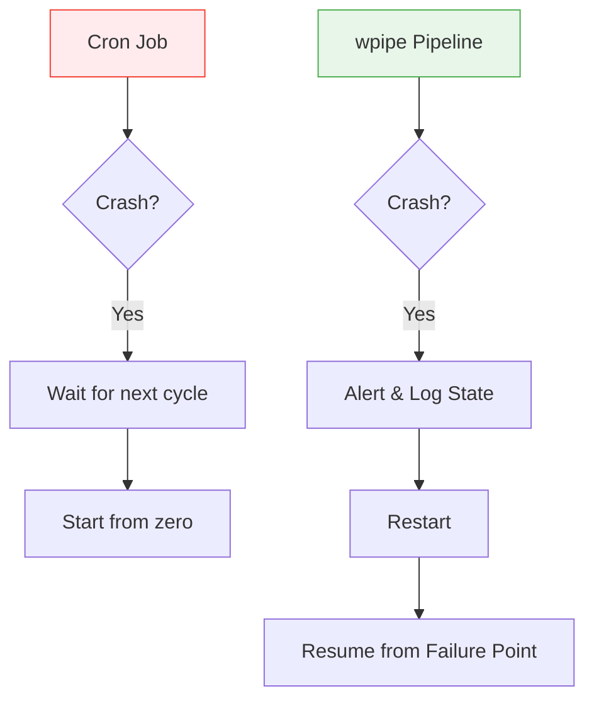

# The Shadow IT of Automation: Why Your Cron Jobs Are a Ticking Time Bomb

*Subtitle: Moving from stateless cron scripts to resilient wpipe pipelines — the path to industrial stability.*

---

If you are a backend developer, you probably have a love-hate relationship with **Cron**. 

On the surface, it’s the perfect tool: simple, native to Unix, and universally understood. You write a script, add a line to `crontab -e`, and you're done. Or so you think.

The problem with Cron is not how it starts, but how it fails. 

## The Silent Failure Trap

Imagine a script that runs every night at 3 AM to synchronize user data. One night, the database is under heavy load and the connection times out. 
*   **What does Cron do?** It records a single line in a system log (if you're lucky) and waits until tomorrow.
*   **What happens to your data?** It remains partially synced, or worse, corrupted. 
*   **When do you find out?** Three days later, when a customer complains about an inconsistency.

Cron is **stateless**. It has no memory of what it did before, and it has no mechanism for intelligent retries or stateful resumption. This is "Shadow IT" — critical business logic running on an infrastructure that provides zero visibility.

## The wpipe Alternative: Orchestration Without Overkill

When developers realize Cron isn't enough, they often look at **Airflow**. But Airflow is a monster. You don't want to manage a Docker cluster just to run a sync script.

**wpipe** was designed exactly for this scenario. It gives you the "Peace of Mind" of an industrial orchestrator with the simplicity of a Cron job.

### Why wpipe is the "New Cron"

### 1. Structured Tracking vs. Silent Logs
In Cron, logs are just text files. In **wpipe**, every execution is a structured entry in a SQLite database. 
*   Did the step fail? You can see the exact traceback.
*   Which variable caused the crash? You can inspect the input data.
*   How long did it take? You have historical metrics out of the box.

### 2. The Checkpoint Advantage (Stateful Resumption)
If your script crashes at step 5 of 10, running it again with Cron means starting at step 1. 
With `wpipe`, the system uses **SQLite Checkpoints**. It knows exactly which steps succeeded. When you restart the pipeline, it skips the completed work and resumes at the point of failure.



### 3. Native Python Logic
You don't need to wrap your code in complex operators. Using wpipe's `@step` (or `@state`) decorators, your existing Python functions become resilient pipeline nodes.

```python
from wpipe import Pipeline, step

@step
def sync_users(data):
    # Your original logic here
    return data

pipeline = Pipeline(pipeline_name="NightlySync")
pipeline.set_steps([(sync_users, "Sync", "v1.0")])
pipeline.run({})
```

## Conclusion: Professionalize Your Automation

It's time to stop relying on hope and start relying on architecture. Moving your critical tasks from Cron to **wpipe** takes less than an hour, but it saves you dozens of hours of debugging and data cleanup in the long run.

Don't let your scripts die in the middle of the night. Give them a memory. Give them resilience. Give them wpipe.

---

**Upgrade your crontab today:**
⭐ [wpipe on GitHub](https://github.com/your-repo/wpipe)

#Python #DevOps #Backend #Cron #Reliability #wpipe #Automation
