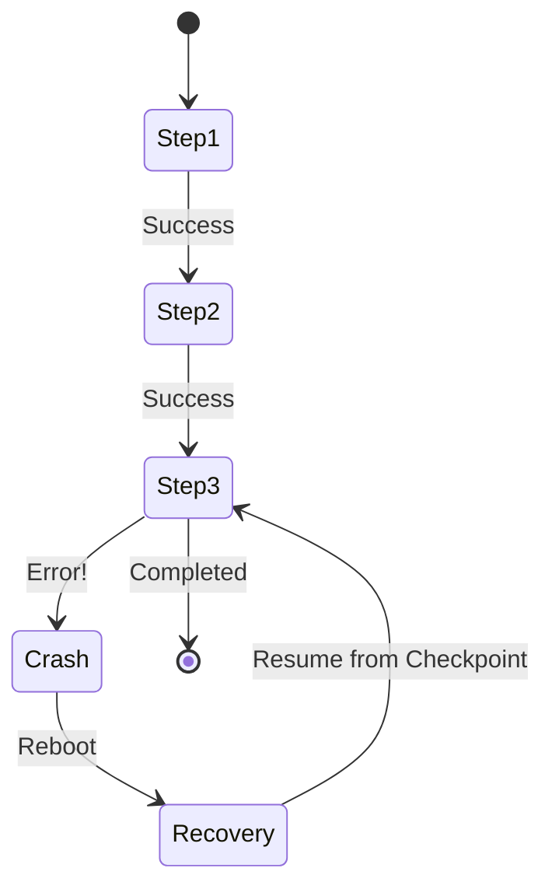

# The Minimalist Path: From Crontab to Intelligent Orchestration

*Subtitle: Why "pip install wpipe" is the best architectural decision you'll make for your recurring Python tasks.*

---

Cron is arguably the most successful piece of software in history. It has been running silently on almost every Unix-based server since 1975. For decades, it was the only way to schedule tasks. But as software complexity grew, the limitations of Cron became glaringly obvious.

We moved from simple scripts to distributed systems, microservices, and massive data pipelines. And yet, many developers still default to `crontab -e` for their recurring Python tasks.

In this article, I want to show you why it’s time to move beyond the "Fire and Forget" era and how **wpipe** provides the most minimalist, yet powerful path to intelligent orchestration.

## The Problem: The Visibility Gap

When you run a script via Cron, you are essentially launching a rocket into a cloud. You know when it launched, but once it enters the cloud, you have no idea what it's doing unless you’ve spent hours writing custom logging logic.

*   **Did it finish?** You have to check a log file.
*   **Why did it fail?** You have to grep through stack traces.
*   **Can I see the history of variables?** No, unless you’ve implemented an external database.

## The wpipe Way: Transparency by Default

When you wrap a script in a **wpipe Pipeline**, the "Visibility Gap" vanishes. Every time your pipeline runs, wpipe automatically records:
1.  **Start and End times** for every single step.
2.  **Input and Output data** (context) for every function.
3.  **Performance metrics** (how long did each node take?).
4.  **Error tracebacks** in a structured, queryable SQLite format.

Instead of a black box, you have a **transparent dashboard of truth**.

## Resilience: The "Cron" We Deserve

The biggest difference between a Cron job and a wpipe Pipeline is **Statefulness**.

If your Cron job fails at 80% completion, tomorrow’s run starts at 0%. This leads to data gaps, inconsistent states, and manual "cleanup" scripts.

**wpipe** implements **SQLite WAL Checkpoints**. This means your pipeline has a memory. 

By adding a `CheckpointManager` to your code, you transform a fragile script into a self-healing system.

## Comparison: The Developer's Reality

| Feature | The Cron Job | The wpipe Pipeline |
| :--- | :--- | :--- |
| **Setup** | `* * * * * python script.py` | `pip install wpipe` |
| **Failure Handling** | Silence | **Automated Retries & Alerts** |
| **Resumption** | Starts from Zero | **Resumes from Checkpoint** |
| **Observability** | Text files (logs) | **Structured SQLite Tracker** |
| **Resources** | Low | **Ultra-low (<50MB RAM)** |
| **Complexity** | 1/10 | **2/10 (Pythonic)** |

## Zen of Python: Code over Configuration

One of the reasons developers stick with Cron is that tools like Airflow or Kubernetes CronJobs feel "too much". They require YAML files, deployment pipelines, and infrastructure management.

wpipe adheres to the **Zen of Python**: "Simple is better than complex."

You don't need to change how you deploy your code. You can still use Cron to *trigger* the wpipe pipeline, but the pipeline itself will handle the complexity of the execution, the state, and the error recovery. 

## Conclusion: Don't settle for "Fire and Forget"

In a professional environment, "I hope it worked" is not a valid status. By moving your recurring tasks to **wpipe**, you are adding a layer of industrial-grade stability without adding the overhead of a complex framework.

It’s time to give your Cron jobs the upgrade they deserve.

---

**Professionalize your Python tasks:**
⭐ [wpipe on GitHub](https://github.com/your-repo/wpipe)

#Python #DevOps #Backend #Automation #wpipe #CleanCode #Reliability
