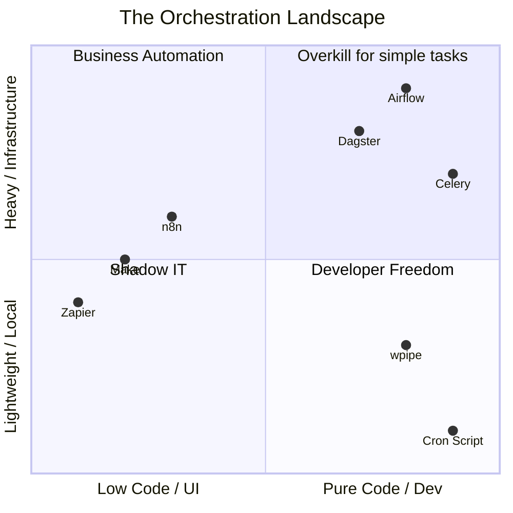

# 🌌 The Orchestration Spectrum: Where does your stack belong?

**Headline: ¿Airflow es demasiado? ¿n8n es muy poco? Hablemos del elefante en la habitación de la Orquestación. 🐘🐍**

He pasado los últimos meses analizando cómo los ingenieros de datos y desarrolladores backend automatizan sus procesos. El mercado está roto en dos extremos polarizados:

🔴 **Extremo 1: "The Visual Toys" (Zapier, Make, n8n)**
Excelentes para marketing y prototipos. Pero el día que necesitas versionar tu lógica en Git, hacer un bucle complejo o usar `pandas`, se convierten en una cárcel de JSONs y "cajas negras".

🔴 **Extremo 2: "The Infrastructure Monsters" (Airflow, Dagster, Celery)**
Poderosos. Industriales. Pero requieren levantar contenedores, gestionar brokers de mensajes (Redis/RabbitMQ) y escribir toneladas de *boilerplate* solo para correr un script de 100 líneas.

Y luego está la "vieja confiable": **El script de Cron**. (Que todos sabemos que falla silenciosamente a las 3 AM 😅).

### 🟢 El Punto de Equilibrio: Presentando wpipe

Diseñé **wpipe** para llenar exactamente ese vacío en el ecosistema Python.

### ¿Por qué wpipe se sitúa en el cuadrante de la "Libertad del Desarrollador"?

1. **Python-First & Git-Friendly:** Nada de arrastrar cajas. Defines tus flujos en YAML o Python puro.
2. **Zero Infrastructure:** No necesitas Docker ni Redis. Funciona con un `pip install`.
3. **Resiliencia Automática (Checkpoints):** wpipe guarda el estado de tus datos en **SQLite** paso a paso.
4. **Tracking de Grado Industrial:** Historial de ejecuciones guardado automáticamente sin configurar servidores externos.

No necesitas un clúster de Kubernetes para orquestar tus datos. Y definitivamente no deberías confiar en un script sin estado.

👇 **Mira el gráfico. ¿En qué cuadrante está sufriendo tu equipo ahora mismo? Te leo en los comentarios.**

#Python #DataEngineering #Airflow #n8n #SoftwareArchitecture #wpipe #OpenSource
