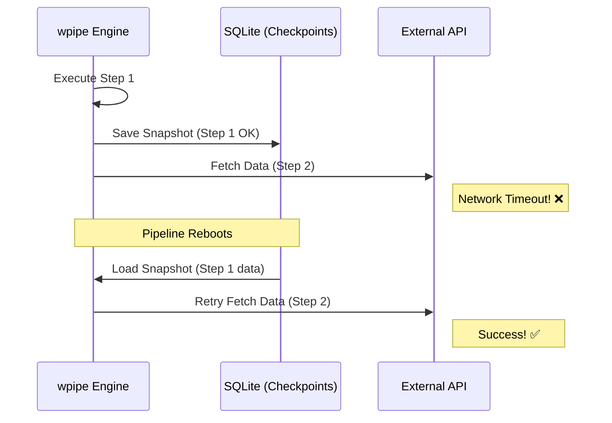

# The Orchestration Spectrum: Why wpipe is the Missing Piece in your Python Stack

*Subtitle: From visual low-code tools like n8n to infrastructure monsters like Airflow — finding the sweet spot for data engineering and automation.*

---

## The Great Orchestration Divide

In the modern software landscape, developers are caught between two extremes. On one side, we have the "Visual Drag-and-Drop" tools like **n8n**, **Zapier**, and **Make**. They are fantastic for quick prototypes and non-technical teams, but they quickly become a "JSON spaghetti" nightmare when you need to implement complex logic, version control, or high-performance Python processing.

On the other side, we have the "Infrastructure Goliaths" like **Apache Airflow**, **Dagster**, and **Prefect**. These are the industry standards for enterprise data lakes. However, they come with a massive "Infrastructure Tax": you need Docker, Kubernetes, Redis, and dedicated DevOps time just to run a sequence of scripts.

And in the dark corner of most servers, there is the **Cron Job** — the silent, stateless, and fragile "old guard" that breaks at 3 AM and leaves no trace of what happened.

**wpipe** was born to bridge this gap. It is a code-first, lightweight, and resilient orchestrator designed for developers who value their time and their system's resources.

---

## The "Battle Card": A Direct Comparison

If you are choosing an orchestrator today, this table summarizes why **wpipe** is the strategic choice for Python-centric teams.

| Feature | Airflow / Prefect | n8n / Zapier | wpipe |
| :--- | :--- | :--- | :--- |
| **Weight / Overhead** | Heavy (GigaBytes/Multiple Containers) | Medium (Docker/JS Runtime) | **Ultra-lightweight (<50MB RAM)** |
| **Setup Complexity** | High (Infra-heavy) | Low (UI-driven) | **Minimal (pip install)** |
| **State Persistence** | External DB Required | Internal (Black box) | **Native (SQLite WAL Checkpoints)** |
| **Developer Experience** | Complex DAGs | Drag & Drop | **Pure Python / YAML** |
| **Version Control** | Excellent (Code) | Difficult (JSON Blobs) | **Native (Git-friendly)** |
| **Security** | External Plugins | Internal Config | **Native (wauth integrated)** |
| **Execution Cost** | High (Cloud Bill) | Medium (Subscription) | **Minimal (Green-IT focus)** |

---

## 1. The Resiliency Revolution: SQLite-backed Checkpoints

The biggest "pain point" in automation is the crash. If a script processing 10,000 records fails at record 9,999, most systems force you to start from zero.

**wpipe** implements a "Save Game" philosophy. Using a highly optimized SQLite WAL (Write-Ahead Logging) engine, wpipe takes a snapshot of your `data` dictionary after every successful step. 



This isn't just "logging"; it's **Stateful Resumption**. You can stop a pipeline, update your code for Step 3, and restart it — wpipe will skip the first two steps and resume exactly where it left off.

---

## 2. The Zen of Clean Code: `@step` and `@state`

Complexity is the enemy of maintainability. In tools like Celery, you often end up with "Callback Hell". In Airflow, you have to wrap everything in `PythonOperator` boilerplate.

With wpipe, your logic stays clean. Using the `@step` decorator (often aliased as `@state` in our examples), any standard Python function becomes a traceable, resumable pipeline node.

```python
from wpipe import Pipeline, step

@step
def fetch_users(data):
    # Pure Python logic
    data["users"] = ["Alice", "Bob"]
    return data

pipeline = Pipeline()
pipeline.set_steps([
    (fetch_users, "Fetch", "v1.0"),
    # ... more steps
])
```

The result? Your code remains readable for any team member, and your business logic isn't "trapped" inside a framework's proprietary syntax.

---

## 3. Green-IT: Why RAM matters

In an era of rising cloud costs and environmental awareness, running a 2GB RAM container to move a few kilobytes of data is a crime.

**wpipe** is designed for the Edge. It runs comfortably on a Raspberry Pi, inside a tiny Lambda, or as a sidecar in a microservice, consuming **less than 50MB of RAM**. This is what we call **Green Orchestration**. 

By choosing wpipe, you aren't just saving money on your AWS bill; you are building a more efficient, sustainable digital infrastructure.

---

## 4. Automatic Documentation (The Mermaid Advantage)

We've all heard the lie: "The code is self-documenting." 

wpipe makes it a reality. Because your pipeline is structured as a sequence of logical blocks (`Condition`, `For`, `Parallel`), wpipe can automatically generate visual diagrams of your flow. No more outdated READMEs. Your documentation is always in sync with your execution logic.

---

## Conclusion: The Developer's Choice

If you are tired of:
- Dragging boxes in a UI that won't let you use Git.
- Maintaining a complex cluster for simple data tasks.
- Waking up to silent Cron failures.

Then it's time to join the **+117,000 users** who have chosen a more intelligent way to automate.

**wpipe** isn't just another library; it's the professional standard for Pythonic orchestration.

👉 [Get started on GitHub](https://github.com/your-repo/wpipe)

#Python #DataEngineering #Automation #OpenSource #wpipe #Airflow #n8n
