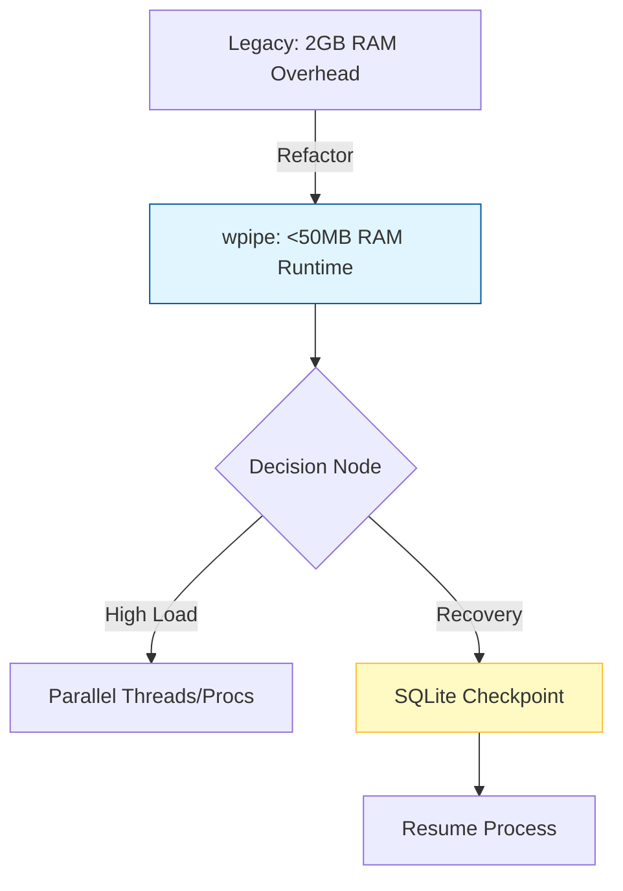

# 🚀 LinkedIn Post: El Despertar del Arquitecto

**Headline: ¿Tu arquitectura es un devorador de recursos o un motor de eficiencia? 🌍**

He visto arquitecturas que necesitan 2GB de RAM solo para "existir" antes de procesar un solo dato. En un mundo que clama por **Green-IT** y eficiencia, esto ya no es aceptable.

El "Despertar del Arquitecto" llega cuando te das cuenta de que la robustez no se mide en gigabytes consumidos, sino en la capacidad de tu sistema para ser resiliente consumiendo lo mínimo.

Entra **wpipe**. 🐍

Mientras otras herramientas de orquestación (Low-Code o pesadas) demandan contenedores gigantescos, **wpipe** orquesta pipelines complejos con apenas unos **Kilobytes** de RAM. 

### 📊 El Impacto de wpipe:
*   **Ahorro Extremo:** Hemos pasado de entornos de 2GB a ejecuciones ultra-ligeras.
*   **Tracción Real:** +117,000 descargas avalan que la comunidad busca ligereza.
*   **Resiliencia Nativa:** SQLite Checkpoints que permiten reanudar procesos fallidos sin perder el estado.

### 🏗️ Arquitectura Visual (wpipe Flow)

**💡 El Futuro es Green-IT:**
Elegir herramientas ligeras no es solo una decisión técnica, es una responsabilidad ambiental y de costes operativos. Menos RAM significa menos servidores, menos energía y más escalabilidad.

👇 **¿En tu stack actual, cuánto pagas de "impuesto de RAM" por tus orquestadores?**

#Architecture #GreenIT #CloudComputing #wpipe #Python #Efficiency #Innovation
