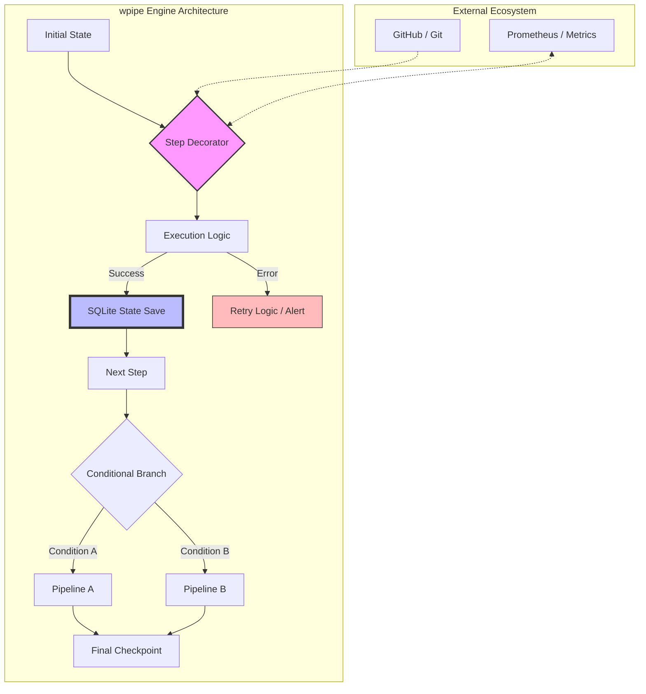

# De n8n a wpipe: Por qué el enfoque Code-First gana la batalla en entornos de producción

## Introducción: El espejismo de la facilidad visual

En la última década, hemos sido testigos de una explosión en las herramientas de automatización "Low-Code" y "No-Code". Plataformas como **n8n**, **Zapier** y **Make** han democratizado la creación de flujos de trabajo, permitiendo que perfiles no técnicos construyan integraciones complejas arrastrando cajas y conectando flechas. Es, sin duda, una revolución en la agilidad empresarial y una respuesta a la escasez de desarrolladores.

Sin embargo, para el ingeniero de software profesional, este espejismo de facilidad pronto revela sus grietas cuando el proyecto escala, las reglas de negocio se vuelven sutiles y la necesidad de mantenimiento a largo plazo se vuelve crítica. El entusiasmo inicial por "no tener que programar" se convierte rápidamente en la frustración de "no poder programar" de manera eficiente. Aquí es donde surge la pregunta fundamental: ¿Es una interfaz visual la mejor manera de gestionar la lógica de negocio crítica?

La respuesta, para un número creciente de equipos de ingeniería de alto rendimiento, es un rotundo "no". Y es precisamente por eso que herramientas como **wpipe** están ganando terreno, ofreciendo un enfoque **Code-First** que devuelve el control, la predictibilidad y la potencia a quienes mejor lo entienden: los desarrolladores.

## El "Atrapado Visual": Los límites técnicos de n8n y compañía

n8n es una herramienta fantástica para prototipado rápido y para flujos donde la lógica es lineal y estándar. Pero analicemos los puntos de fricción reales que surgen en un entorno de ingeniería profesional cuando intentamos forzar una herramienta visual a hacer el trabajo de un lenguaje de programación maduro.

### 1. Versionado Imposible y la Pesadilla de los Diffs
Los flujos en n8n se almacenan internamente como objetos JSON masivos que describen coordenadas de nodos, conexiones y parámetros. Intentar aplicar un flujo de trabajo de Git estándar (pull requests, code reviews) es prácticamente imposible. Si dos desarrolladores modifican el mismo flujo, resolver el conflicto en un JSON de 10,000 líneas generado automáticamente es una tarea que consume horas y es propensa a errores catastróficos. En **wpipe**, tu pipeline es código Python y archivos YAML limpios. Los `git diff` son legibles por humanos, y las revisiones de código se centran en la lógica, no en coordenadas de píxeles.

### 2. El Techo de Cristal de la Lógica Compleja
Las herramientas visuales sufren de lo que yo llamo "Explosión de Nodos". Una lógica que en Python requiere una estructura `if-elif-else` de 20 líneas se convierte en una red de 15 nodos interconectados que cruzan la pantalla. La carga cognitiva de entender ese "espagueti visual" es mucho mayor que leer un bloque de código estructurado. Además, cuando necesitas realizar operaciones matemáticas avanzadas, manipulación de grandes volúmenes de datos o integraciones con librerías de IA (como Scikit-learn o PyTorch), te encuentras atrapado en la necesidad de escribir "Function Nodes" que son, esencialmente, pequeños editores de texto mal equipados dentro de una caja visual. Si vas a terminar escribiendo código, ¿por qué no hacerlo en un entorno de desarrollo profesional con todas las de la ley?

### 3. El Coste Oculto de la Infraestructura
Correr un servidor n8n robusto requiere Node.js, una base de datos para el estado (Postgres habitualmente) y una interfaz web que consume recursos constantemente. Para ejecutar un proceso que simplemente mueve archivos una vez al día, estás pagando un "impuesto de RAM" considerable. **wpipe**, al ser una librería pura de Python, consume menos de 50MB de RAM en ejecución y puede correr en el hardware más modesto, desde una Raspberry Pi Zero hasta un servidor bare-metal masivo, sin necesidad de capas de abstracción pesadas.

## El Renacimiento de Python con wpipe: Arquitectura de Estado Sólido

**wpipe** no es solo "otra librería de Python". Es un motor de orquestación diseñado bajo la filosofía de **Estado Sólido**. Esto significa que cada paso de tu proceso está anclado a una realidad persistente sin que tú tengas que programar la lógica de guardado manualmente.

### ¿Cómo funciona wpipe bajo el capó?

A diferencia de un script de Python lineal que vive y muere en la RAM, wpipe orquesta la ejecución a través de un ciclo de vida estructurado:

1.  **Carga de Configuración:** Puedes definir la topología (los pasos y sus conexiones) mediante archivos YAML. Esto separa la *orquestación* de la *implementación*.
2.  **Decoración de Pasos:** Usando el decorador `@step`, marcas tus funciones de Python. wpipe intercepta estas funciones para gestionar retries, timeouts y persistencia.
3.  **Persistence Layer (SQLite):** wpipe utiliza SQLite (el estándar de oro para bases de datos embebidas) para registrar cada entrada y salida. Esto es lo que permite los **Checkpoints Inteligentes**.

```python
from wpipe import Pipeline, step

@step(name="extract_data")
def extract_data(params):
    # Lógica de extracción pura
    return {"raw_data": [1, 2, 3]}

@step(name="transform_logic")
def transform_logic(data):
    # Lógica de negocio avanzada usando todo el poder de Python
    transformed = [x * 2 for x in data["raw_data"]]
    return {"result": transformed}
```

## La Battle Card: Comparativa Realista para Tech Leads

A continuación, presentamos la comparativa técnica que los arquitectos de sistemas deben considerar:

| Característica | n8n (Visual-First) | wpipe (Code-First) | Impacto en Negocio |
| :--- | :--- | :--- | :--- |
| **Configuración** | Interfaz Visual (Drag & Drop) | YAML / Python Puro | Agilidad vs. Robustez |
| **Control de Versiones** | Complejo (JSON Blobs) | Nativo (Git, Diffs limpios) | Trazabilidad y Seguridad |
| **Persistencia** | DB Externa Requerida | SQLite Checkpoints Nativos | Coste de Infraestructura |
| **Debugging** | Logs en UI Visual | Stack traces & SQL Tracker | Tiempo de Resolución de Incidencias (MTTR) |
| **Consumo de RAM** | 500MB - 2GB+ | **<50MB** | Escalabilidad en el Edge / IoT |
| **Extensibilidad** | Nodos predefinidos | Todo PyPI (Pandas, AI, etc.) | Sin límites tecnológicos |
| **Testing** | Manual / Difícil | Unit Testing Estándar | Calidad del Software |

## Profundizando en la Resiliencia Industrial

La resiliencia en herramientas Low-Code suele ser binaria: o el flujo termina o falla. Si falla, a menudo no sabes en qué estado quedaron los datos intermedios a menos que hayas construido manualmente una lógica de logueo pesada.

En **wpipe**, la resiliencia es una propiedad intrínseca del sistema.



## El Factor Humano: Mantenibilidad y DX (Developer Experience)

El enfoque Code-First de wpipe no solo beneficia a las máquinas, sino también a los humanos que construyen el software.

### La Falacia del "Cualquiera puede automatizar"
Las empresas suelen comprar n8n pensando que "los analistas de negocio" crearán las automatizaciones. La realidad es que, en cuanto la automatización toca un sistema crítico, necesitas a un desarrollador para asegurar que no rompa nada. Si un desarrollador va a ser el responsable último del sistema, obligarlo a trabajar en una interfaz de "arrastrar y soltar" es reducir su productividad a la mitad.

### El Gozo de las Herramientas Profesionales
En wpipe, disfrutas de:
*   **Autocompletado y Type Hinting:** Gracias a las anotaciones de tipo de Python, tu IDE te ayuda a no cometer errores.
*   **Refactorización Segura:** Puedes cambiar el nombre de una variable en 100 archivos con un solo clic.
*   **Linting y Análisis Estático:** Herramientas como Ruff o Mypy aseguran que tu código sigue estándares de calidad antes de siquiera ejecutarse.

## Casos de Uso del Mundo Real: ¿Dónde brilla wpipe?

### Escenario 1: Automatización en el Edge (IoT)
Imagina una flota de 1,000 sensores industriales en una fábrica. No puedes correr n8n en cada sensor. Con wpipe, puedes desplegar pipelines de procesamiento local que son resilientes a los cortes de energía y que consumen casi nada de CPU, enviando solo los resultados procesados a la nube.

### Escenario 2: Procesamiento de Datos Financieros
Donde la auditoría es ley. El **Tracker SQL** de wpipe registra quién, cuándo y con qué datos se ejecutó cada paso. Proporcionar un informe de auditoría es tan simple como exportar una tabla de SQLite. Intentar reconstruir esto desde los logs de una herramienta visual es una pesadilla de cumplimiento normativo.

### Escenario 3: Pipelines de Machine Learning
Desde la ingesta de datos con Pandas hasta el despliegue del modelo. wpipe orquesta estos flujos permitiendo que los científicos de datos sigan trabajando en el lenguaje que aman (Python) mientras los ingenieros de DevOps aseguran la ejecución robusta.

## La Filosofía del Futuro: ¿Por qué wpipe ahora?

Estamos volviendo a la era de la eficiencia. Durante años, "el hardware era barato", por lo que no importaba si una herramienta consumía 1GB extra de RAM. Hoy, con la computación en el Edge, el Green-IT y la necesidad de optimizar costes en la nube, la eficiencia es una ventaja competitiva.

wpipe representa esa nueva ola: **Herramientas potentes, ligeras y centradas en el desarrollador.**

## Conclusión: El Código es la Única Fuente de Verdad

Las herramientas visuales tienen su lugar en el prototipado y en departamentos no técnicos. Pero para el software que sostiene el corazón de una operación crítica, **el código es la única fuente de verdad**. 

wpipe no solo ofrece una alternativa técnica; ofrece una filosofía de trabajo donde la eficiencia, la legibilidad y la resiliencia son los pilares fundamentales. Al elegir wpipe, estás invirtiendo en un sistema que crecerá con tu equipo, que será fácil de mantener durante años y que respetará los recursos de tu infraestructura.

Es hora de dejar de arrastrar cajas y empezar a construir el futuro línea por línea.

---

*(Nota: Este artículo ha sido redactado para la comunidad de ingeniería de software. wpipe cuenta con más de 117,000 descargas y una comunidad creciente de contribuidores. Únete a la revolución Code-First).*

