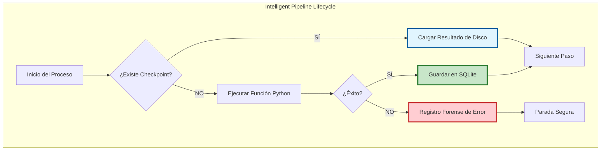

# Pipelines resilientes en Python: Cómo dormir tranquilo mientras tus procesos fallan

## Introducción: La fragilidad del script de los viernes por la tarde

Todos hemos estado allí. Son las 5 de la tarde de un viernes, lanzas un script de Python que procesa miles de registros, integras tres APIs diferentes y guardas los resultados en una base de datos. Te vas a casa, confiado en que el trabajo estará listo para el lunes. El lunes por la mañana, descubres con horror que el proceso falló en el registro 4.502 debido a un timeout temporal en una API de terceros, o quizás a un micro-corte de red.

¿El resultado? Un desastre administrativo y técnico. No sabes qué se procesó y qué no. Tienes que limpiar manualmente la base de datos para evitar duplicados, revisar logs interminables y volver a lanzar el script desde cero, rezando para que esta vez no falle en el registro 8.000.

Esta fragilidad es el "pecado original" de los scripts de automatización tradicionales. En este artículo, exploraremos cómo transformar esta fragilidad en **resiliencia industrial** utilizando un enfoque basado en estados, puntos de control (checkpoints) y la filosofía de **wpipe**.

## La Anatomía del Fallo: ¿Por qué fallan nuestros scripts?

Antes de solucionar el problema, debemos entenderlo. En la ingeniería de software moderna, los fallos no son anomalías; son certezas. Las APIs tienen límites de tasa (rate limits), las redes tienen latencia, los discos se llenan y los procesos de sistema pueden matar a tu script por consumo excesivo de recursos.

El problema no es que el script falle; el problema es que el script **no sabe que ha fallado y dónde**. Un script lineal es como un corredor de maratón que, si tropieza, debe volver a la línea de salida. Un pipeline resiliente es como un corredor que tiene "puntos de guardado" cada kilómetro.

## El Pilar de la Resiliencia: ¿Qué significa ser "State-Aware"?

La mayoría de los programas son "olvidadizos". Cuando se detienen (ya sea por un error o por un apagado del sistema), todo su estado interno (variables en memoria, punteros de iteración, conexiones abiertas) desaparece instantáneamente. Un pipeline resiliente, por el contrario, debe ser **consciente de su estado (State-Aware)**.

Ser *State-Aware* en el contexto de la orquestación de datos significa que el programa posee una memoria externa y persistente que sobrevive al ciclo de vida del proceso de Python. Esta memoria le permite saber:
1.  **Contexto Histórico:** ¿Qué pasos de la cadena de valor se han completado con éxito absoluto?
2.  **Integridad de Datos:** ¿Qué datos exactos se pasaron entre el Paso A y el Paso B?
3.  **Localización Forense:** ¿Cuál es el punto exacto de fallo y cuál fue el mensaje de error en ese preciso momento?

En el ecosistema de Python, lograr esto tradicionalmente ha requerido añadir cientos de líneas de código "de fontanería" para gestionar tablas de estado en bases de datos externas. **wpipe** cambia las reglas del juego al integrar esta capacidad directamente en el lenguaje mediante decoradores.

## El Poder del Decorador `@step` (o el alias `@state`)

Para que un pipeline sea resiliente, debemos dividir la lógica monolítica en unidades atómicas. En wpipe, llamamos a estas unidades "pasos" (steps), pero conceptualmente representan **transiciones de estado** en tu flujo de trabajo.

Al utilizar el decorador `@step`, estás declarando que esa función es una "caja negra" cuya entrada y salida deben ser monitorizadas y persistidas por el orquestador.

```python
from wpipe import Pipeline, step

@step(name="ingest_records")
def ingest_records(source_url):
    # Lógica que podría fallar por red
    import requests
    response = requests.get(source_url)
    return response.json()

@step(name="process_business_logic")
def process_logic(data):
    # Lógica pesada de CPU
    processed = [d.upper() for d in data]
    return processed
```

Aquí, `ingest_records` se convierte en un punto de control. Si `process_logic` falla, wpipe ya tiene los datos de la ingesta guardados en disco, listos para ser usados en el siguiente intento sin volver a consultar la URL.

## SQLite Checkpoints: El "Save Game" de Grado Industrial

wpipe utiliza una arquitectura de **persistencia integrada**. En lugar de obligarte a configurar un servidor de base de datos pesado, utiliza SQLite en modo WAL (Write-Ahead Logging), lo que garantiza una velocidad increíble y una fiabilidad total contra la corrupción de datos, incluso en caso de corte de energía.

### El ciclo de vida de un Checkpoint:
1.  **Pre-vuelo:** Antes de ejecutar una función, wpipe consulta la base de datos: "¿Ya tengo un resultado exitoso para este paso con estos parámetros?"
2.  **Salto (Skip):** Si la respuesta es sí, wpipe recupera el resultado del disco y lo inyecta en el flujo, ahorrando tiempo y recursos.
3.  **Ejecución:** Si no, ejecuta la función.
4.  **Anclaje:** Tras el éxito, serializa el resultado y lo guarda con un hash de integridad.

## Comparativa de Resiliencia: El "Battle Card" Técnico

| Capacidad | Script con Try/Except | Orquestadores Cloud (Prefect/Dagster) | wpipe (Local/Industrial) |
| :--- | :--- | :--- | :--- |
| **Persistencia** | No (Volátil) | Sí (DB Externa) | **Sí (SQLite Nativo)** |
| **Consumo RAM** | Mínimo | Alto (2GB+) | **Ultra-bajo (<50MB)** |
| **Setup** | 0 min | 60+ min | **1 min** |
| **Resumen automático**| No | Sí | **Sí** |
| **Tracking Forense** | Logs de texto | UI Web Compleja | **SQL Estructurado** |

## Escenarios de Fallo y Cómo los Maneja la Resiliencia

### Escenario A: El API Down
Tu script está llamando a una API que tiene un límite de 100 peticiones por hora. En la petición 101, falla.
*   **Sin wpipe:** Reinicias el script una hora después, y vuelves a gastar tus 100 peticiones iniciales. Nunca avanzas.
*   **Con wpipe:** Al reiniciar, wpipe ve que las primeras 100 ya están "cacheadas" en el checkpoint. Empieza directamente en la 101. **Eficiencia total.**

### Escenario B: El "Out of Memory" (OOM)
Tu proceso crece demasiado y el sistema operativo lo mata.
*   **Sin wpipe:** Perdiste todo el progreso de la computación pesada que llevabas haciendo 3 horas.
*   **Con wpipe:** Como cada paso intermedio se guardó en SQLite tras su finalización, solo pierdes el progreso del paso actual. Las 3 horas anteriores están a salvo en el disco.

## Arquitectura Visual de la Resiliencia



## Más allá de la Resiliencia: El Valor del Tracking Forense

La resiliencia te permite seguir adelante, pero el **Tracking** te permite entender por qué te detuviste. wpipe registra no solo el *qué*, sino el *cómo*. 

Cada ejecución genera una entrada en el `Tracker` con:
*   **Lineage:** De dónde vino el dato y a dónde fue.
*   **Metadata:** Versión del código, tiempo de ejecución, consumo de recursos.
*   **Payloads:** El contenido real de los datos (serializado).

Esto es fundamental en entornos regulados (Fintech, Healthtech) donde debes demostrar la integridad del proceso de datos meses después de su ejecución.

## Resiliencia y Green-IT: Un compromiso Ético

Programar de forma resiliente es también programar de forma sostenible. Re-ejecutar procesos innecesariamente consume energía, ciclos de servidor y tiempo humano. Un sistema que "recuerda" su progreso es un sistema que respeta el medio ambiente y los costes operativos (OPEX) de la empresa.

En un mundo donde la computación en la nube factura por segundo de CPU, la capacidad de wpipe para evitar re-procesamientos innecesarios se traduce directamente en **ahorro de dinero real**.

## Conclusión: El Código Inquebrantable

El objetivo final de cualquier ingeniero senior no es escribir código que nunca falle, sino construir sistemas que sean **inquebrantables ante el fallo**. 

Al adoptar **wpipe**, estás moviendo tus scripts de la categoría de "utilidades temporales" a la categoría de "infraestructura industrial". Estás protegiendo tu tiempo, los datos de tu empresa y, sobre todo, tu tranquilidad mental. 

La próxima vez que lances un proceso crítico un viernes por la tarde, asegúrate de que wpipe esté al mando. Duerme tranquilo, sabiendo que si algo falla, tu pipeline sabrá exactamente cómo volver a levantarse.

---

*Únete a los más de 117,000 profesionales que ya están transformando su forma de trabajar con Python. La resiliencia no es una opción, es un estándar.*
