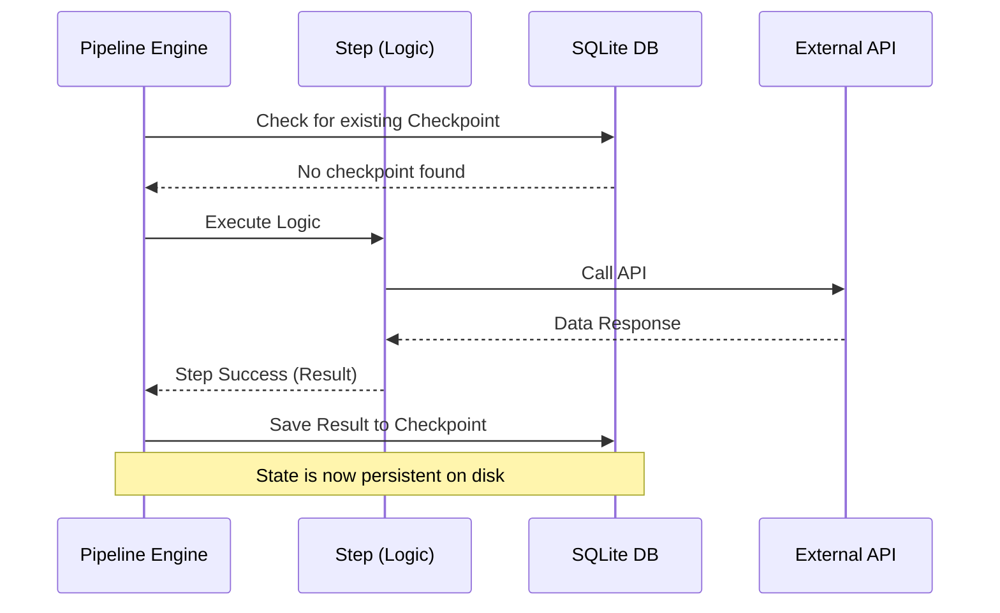

# Industrial Resilience: Architecting Robust Pipelines in Python

In the world of industrial automation and enterprise data processing, "it works on my machine" is not enough. We need systems that are **Antifragile**—systems that don't just survive failures but are designed to handle them gracefully without data loss or manual intervention.

In this article, we explore the architecture of industrial-grade pipelines using **wpipe**, a Python-native orchestrator that prioritizes resilience and resource efficiency.

## The Pillars of Industrial Resilience

Building for the "Happy Path" is easy. Architecting for the "Failure Path" is where the real engineering happens. An industrial pipeline must possess three core characteristics:

1.  **Immutability of State:** Each step should have a clear input and output that is persisted.
2.  **Idempotency:** Re-running a failed step should not cause side effects.
3.  **Observability:** You must be able to perform a "forensic analysis" on why a specific piece of data failed.

## wpipe Architecture: Solid-State Orchestration

Unlike legacy orchestrators that rely on memory-heavy workers and complex message brokers, wpipe uses a **Solid-State** approach. It leverages **SQLite Checkpoints** to ensure that the state of the pipeline is always synchronized with the disk.

### The Execution Flow



## Comparative Analysis: The Battle Card

When choosing an orchestration layer for industrial applications, the overhead of the tool itself is a critical factor.

| Feature | Legacy Enterprise Tools | wpipe (Industrial) |
| :--- | :--- | :--- |
| **Footprint** | 2GB+ RAM / Multiple Containers | <50MB RAM / Single Process |
| **Resilience Mechanism** | External Heartbeats / Re-queuing | Native SQLite Checkpoints |
| **Tracking** | Centralized Logs (Text) | Structured SQL Tracker (Forensic) |
| **Deployment** | Kubernetes / Heavy Infra | Bare Metal / Edge / Cloud |
| **Version Control** | Proprietary UI / Blobs | Git-Native (Python/YAML) |

## Implementing a Resilient Step

The beauty of wpipe is that it doesn't force you to learn a new language. You write Python, and wpipe provides the infrastructure.

```python
from wpipe import Pipeline, step

@step(name="Industrial_Ingest")
def ingest_sensor_data(sensor_id):
    # Logic to fetch data from PLC/Sensor
    return {"temp": 25.5, "pressure": 1.2}

@step(name="Data_Validation")
def validate_telemetry(data):
    if data["temp"] > 100:
        raise ValueError("Critical Overheat!")
    return True
```

In an industrial setting, if `Data_Validation` fails, the `Industrial_Ingest` result is already safe in the SQLite database. When the technician clears the error and restarts the service, the system resumes immediately from the validation step.

## Forensic Observability

One of the standout features of wpipe is the **Tracker**. Every execution generates a structured audit trail. This is vital for industries where compliance and auditing are non-negotiable (e.g., Pharmaceuticals, Aerospace, Finance).

The Tracker records:
*   Timestamp of execution.
*   The exact Python file and line number that triggered the step.
*   Serialized Input and Output data.
*   Full Traceback in case of failure.

## Conclusion

Resilience is not a feature you "add" to a system; it's a property of its architecture. By choosing a lightweight, state-aware orchestrator like **wpipe**, engineers can build pipelines that are ready for the harsh realities of production environments.

With over 117,000 downloads, wpipe is proving that the future of enterprise orchestration is Pythonic, lightweight, and incredibly resilient.

#EnterpriseArchitecture #IndustrialAutomation #Python #wpipe #SoftwareEngineering #DZone
