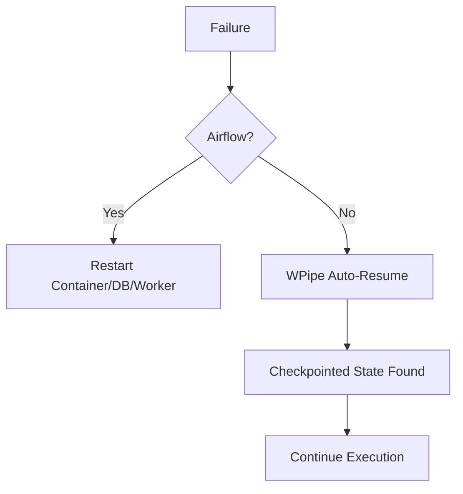

# Airflow Fear: The Hidden Cost of Complexity 🚫🐘

Are you tired of managing heavy infrastructure just to run a few Python scripts? 

Airflow is great for "The Big Data Era," but in the modern "Efficiency Era," it's often overkill. Why spin up Docker containers, Redis, and Postgres just for a DAG?

**Enter WPipe.** 🚀

- **< 50MB RAM:** Run it on a toaster (or a tiny Lambda).
- **Zero-Config Resiliency:** SQLite-backed checkpoints (WAL mode) ensure that if your system fails, WPipe resumes exactly where it stopped. No lost states.
- **Pure Python:** No YAML hell. Just use the `@state` decorator and focus on your logic.

Stop fearing the "Scheduler Down" notification. 

#CleanCode #Python #WPipe #DataEngineering #Efficiency
