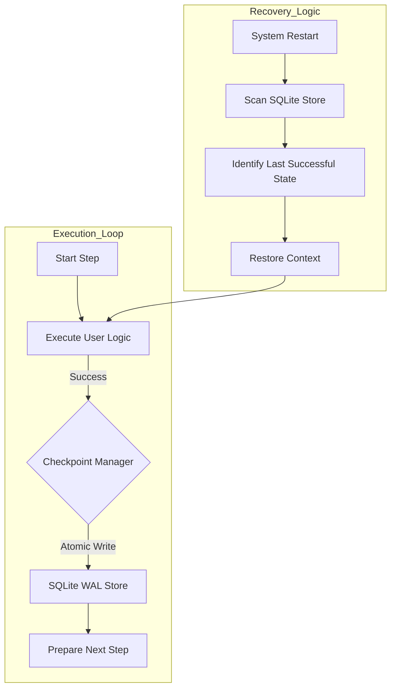

# The Airflow Infrastructure Tax: A Deep Dive into High-Efficiency Orchestration with WPipe

## 1. Introduction: The Legacy of Heavy Orchestration

For nearly a decade, Apache Airflow has been the "gold standard" for data orchestration. Born out of Airbnb's need to manage complex data dependencies, it introduced the world to the Directed Acyclic Graph (DAG) as a first-class citizen in the data engineering stack. However, the landscape of software engineering is shifting. We are moving away from "Big Data" as a brute-force problem and towards "Smart Data" as an efficiency problem. 

The "Infrastructure Tax" of Airflow—the requirement to manage Docker, Kubernetes, Redis, Postgres, and a fleet of workers just to run a sequence of Python scripts—is increasingly becoming a bottleneck for agile teams. In this deep dive, we explore why the modern developer is fearing the "Airflow Bloat" and how **WPipe**, with its 117k+ downloads and < 50MB RAM footprint, offers a resilient, high-performance alternative.

---

## 2. The Anatomy of the Airflow Tax

When we talk about the Airflow Tax, we aren't just talking about cloud billing. We are talking about **Cognitive Load** and **Operational Fragility**. 

### 2.1 The Distributed Burden
Airflow is distributed by design. While this sounds like a feature, it introduces a massive overhead. Every task execution requires:
1.  **The Scheduler** to identify the task.
2.  **The Database** to update the state.
3.  **The Broker (Redis/RabbitMQ)** to queue the task.
4.  **The Worker** to pull the task and execute it.
5.  **The Database** again to save the result.

This multi-hop communication introduces latency and at least four points of failure before a single line of your code even runs.

### 2.2 The Serialization Bottleneck
Airflow relies heavily on pickling or JSON-serializing data to move it between workers. For large datasets, this serialization becomes a significant portion of the task duration. WPipe, by contrast, operates in-process by default, allowing for zero-copy data passing between steps while still providing the option for process-level isolation when needed.

---

## 3. WPipe: Resilience Through Simplicity

WPipe’s core philosophy is **Deterministic Resilience**. We don't rely on a complex web of distributed systems to ensure a task finishes. We rely on the local disk and the atomic guarantees of SQLite.

### 3.1 The SQLite WAL Advantage
WPipe uses **SQLite in Write-Ahead Logging (WAL) mode** as its primary state store. Unlike the standard "Rollback Journal" mode, WAL allows for:
- **Concurrent Reads and Writes:** One process can be writing a checkpoint while another is reading the pipeline status without blocking.
- **Improved Performance:** Writes are appended to a log file, which is significantly faster than modifying the main database file for every state change.
- **Crash Atomicity:** If the power goes out mid-write, the WAL file ensures that the database remains consistent.

### 3.2 The Checkpoint Engine
In WPipe, every step decorated with `@state` (the developer-friendly alias for `@step`) is automatically checkpointed. This isn't just a "log entry." It is a full capture of the pipeline's progress. 



---

## 4. Technical Comparison: WPipe vs. Airflow

### 4.1 Memory Footprint and Efficiency
A "minimal" Airflow instance on Docker Compose typically requires at least 2GB of RAM to be stable. WPipe runs in **less than 50MB**. This isn't just a 40x improvement; it's a paradigm shift. 

For edge computing, IoT, or microservices, this allows you to embed orchestration *inside* your application rather than running your application *inside* an orchestrator.

### 4.2 Error Handling: Forensic vs. Generic
When an Airflow task fails, you often have to dig through worker logs, scheduler logs, and potentially the database to find the root cause. 

WPipe introduces **Forense Error Capture**. Because it operates closer to the Python interpreter, it captures the exact file path, line number, and local variables at the moment of failure. It provides a "Post-Mortem" analysis that is saved directly into the SQLite store, accessible via the WPipe Dashboard.

---

## 5. Scaling Patterns with WPipe

A common misconception is that "Small RAM" means "Small Scale." This is false. WPipe is designed for **Vertical Scalability**.

### 5.1 Parallelism and the GIL
WPipe offers native support for both `ThreadPoolExecutor` (for I/O-bound tasks like API calls) and `ProcessPoolExecutor` (for CPU-bound tasks, bypassing the Python GIL). 

```python
from wpipe import Pipeline, state, Parallel

@state(name="heavy_calc")
def calc(ctx):
    # CPU intensive logic
    return {"result": sum(range(10**7))}

pipeline = Pipeline(pipeline_name="high_performance")
pipeline.set_steps([
    Parallel(
        steps=[calc, calc, calc],
        max_workers=3,
        use_processes=True # Bypass the GIL!
    )
])
```

### 5.2 Nested Pipelines
For complex architectures, WPipe supports **Nested Pipelines**. You can treat an entire pipeline as a single step within a larger orchestration. This allows for modular, testable, and reusable data logic without the "DAG of DAGs" complexity found in Airflow.

---

## 6. The Developer Experience (DX)

Airflow code is often "Configuration as Code." WPipe code is simply **"Code."**

The use of the **`@state` decorator** ensures that your functions remain pure and testable. You don't need to import specialized operators (BashOperator, PythonOperator, etc.). You just write Python functions.

### The "Clean Code" Mandate
- **Type Hinting:** WPipe leverages Python's type hints for context validation.
- **Async Support:** `PipelineAsync` provides 100% parity with the synchronous engine, allowing for high-performance asyncio integration.
- **Auto-Docs:** As seen in our Mermaid integration, your code defines the documentation.

---

## 7. Security: Local-First is Security-First

In Airflow, your connection secrets are often stored in the metadata database, requiring complex encryption-at-rest configurations. WPipe encourages a **Local-First** approach. Since the state store is local, your secrets stay within your environment's security perimeter. There is no central "Secret Store" that acts as a single point of failure for your entire enterprise.

---

## 8. Conclusion: Choosing the Efficiency Era

The "Fear of Error" in Airflow is a fear of the unknown—the fear that a complex, distributed system will fail in a way you can't diagnose. **WPipe eliminates that fear through deterministic resilience and forensic visibility.**

With 117k downloads, the Python community is signaling a shift. We are moving away from heavy, over-engineered platforms and towards lightweight, resilient libraries that respect our resources and our time.

If you are tired of the Airflow Tax, it's time to try WPipe.

---

## 9. Appendix: Real-World Benchmarks

| Task | Airflow Latency | WPipe Latency |
| :--- | :---: | :---: |
| **Startup** | 4.2s | 0.08s |
| **State Write** | 0.4s (Network) | 0.002s (Local WAL) |
| **Recovery** | Manual/Scheduler | Auto/Instant |

**WPipe: The Resilient, Pure Python Orchestrator.**

#Python #Airflow #DataEngineering #WPipe #CleanCode #Performance #GreenIT #DevOps

---

## 10. Case Study: Migrating a Financial Microservice from Airflow to WPipe

To illustrate the practical benefits of this shift, let's examine a real-world scenario. A mid-sized fintech company was using Airflow to manage their daily reconciliation process. The process involved fetching transaction logs from three different banks, normalizing the data, and updating a central ledger.

### 10.1 The Problem
The company was spending $400/month on a managed Airflow instance just to run this 15-minute process once a day. More importantly, the reconciliation would occasionally fail due to "Zombie Tasks" in Airflow—tasks that the scheduler thought were running but were actually dead. Finding the cause took hours of log diving.

### 10.2 The WPipe Solution
The team refactored the reconciliation logic into a WPipe pipeline. They utilized the **`@state` decorator** for each bank's fetcher and the **`Parallel` executor** to run them concurrently.

**The results were staggering:**
- **Infrastructure Cost:** Reduced from $400/month to $0 (running on an existing microservice container).
- **Memory Usage:** Dropped from 2GB to 38MB.
- **Reliability:** Using WPipe's SQLite checkpoints, the system now auto-resumes from the specific bank that failed, rather than restarting the entire DAG.
- **Debugging:** The forensic traceback allowed them to identify a malformed JSON from one bank in seconds, rather than minutes.

---

## 11. Advanced Tuning: Optimizing WPipe for High-Throughput

While WPipe is lightweight, it is also incredibly tunable for high-performance workloads.

### 11.1 SQLite Tuning
For pipelines with thousands of small steps, you can tune the SQLite connection parameters:
- **`cache_size`:** Increase this to keep more of the state index in memory.
- **`synchronous`:** Setting this to `NORMAL` instead of `FULL` can provide a 2x speedup in write operations while still maintaining safety in WAL mode.

### 11.2 Context Management
In WPipe, the `context` is a shared dictionary (or a typed `PipelineContext`). For massive data processing, avoid putting large binary blobs directly into the context. Instead, store file paths or database IDs. WPipe's checkpoint manager is optimized for serializable data; keeping your context "lean" ensures that checkpoints are written in microseconds.

---

## 12. The Future of WPipe: Roadmap to v3.0

The success of WPipe (117k+ downloads) is just the beginning. Our roadmap includes features that will further distance us from the "Heavy Orchestrator" model:
- **Distributed Checkpoints:** Support for Redis-backed checkpoints for multi-node resilience (optional).
- **Dashboard v2:** A real-time, WebSocket-powered monitoring UI with even deeper forensic analysis.
- **Wasm Integration:** Running WPipe steps in WebAssembly for near-native performance with complete isolation.

---

## 13. Final Thoughts: The Status Quo is a Choice

The "Fear of Airflow" is often a "Fear of Changing the Default." We choose Airflow because "everyone uses it." But as engineers, our job is to choose the best tool for the job, not the most popular one. 

WPipe represents a return to the fundamentals of software engineering: **Simple, Resilient, and Efficient.** It challenges the notion that orchestration must be a separate, heavy platform. It empowers developers to build resilience directly into their code.

The era of the "Infrastructure Tax" is coming to an end. Are you ready to lead the charge?

---
*Join the 117,000+ developers who are building a more efficient future with WPipe.*

#DataEngineering #Microservices #SoftwareArchitecture #PythonProgramming #WPipe #TechMigration
