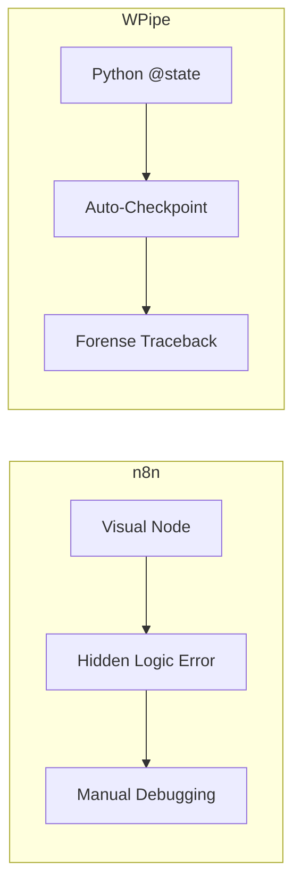

# Low-Code, High-Risk? Why n8n users are moving back to Code. 🛠️➡️🐍

Visual builders like n8n are beautiful until you hit a logic wall. When your workflow gets complex, "drag-and-drop" becomes "drag-and-drop-and-pray."

**WPipe** offers the visual clarity of a DAG with the absolute power of Python.

- **Forense Error Capture:** Get the exact file and line of the failure. No more digging through JSON nodes.
- **117k+ Downloads:** A community that trusts code over canvas.
- **SQLite Resilience:** Native checkpoints mean your data is safe even if the server reboots.

Why limit yourself to a UI when you can have a resilient, lightweight pipeline in pure Python?

#n8n #Automation #WPipe #PythonDev #Resilience
