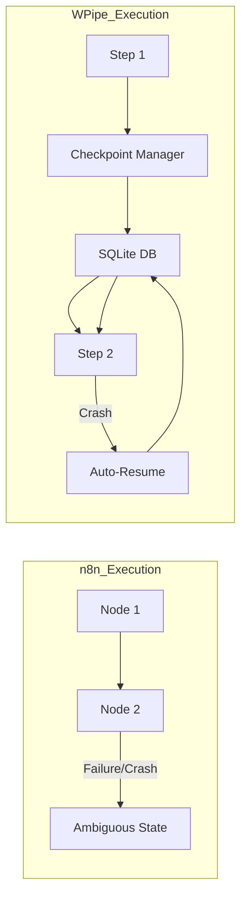

# Beyond the Canvas: Why n8n Users are Returning to Code-First Orchestration with WPipe

## 1. The Visual Allure vs. The Production Reality

We’ve all been there. You have a simple task—say, syncing a Google Sheet with a Discord notification—and n8n looks like magic. You drag a node, you drop a node, you connect them with a digital wire, and *voilà*: automation. Low-code platforms like n8n and Zapier have revolutionized how non-developers interact with APIs. They promise a world where "everyone is a developer" and logic is as simple as drawing a flowchart.

But as your logic grows, the "canvas" begins to feel like a cage. What happens when you need complex conditional branching that depends on external state? What happens when you need to handle circular references or non-serializable objects that the visual JSON parser can't handle? What happens when a node fails, and all you get is a generic "Internal Server Error" in a massive JSON blob that you have to parse manually?

This is the "Logic Wall," and many developers who started with n8n are now hitting it hard. They are realizing that visual programming is great for prototyping but brittle for production. The solution isn't "more nodes." The solution is a return to code, but with the guardrails of a modern orchestrator. The solution is **WPipe**.

---

## 2. The Logic Wall: When Visual Becomes Visceral

In a visual builder, complexity scales horizontally. A pipeline that does 10 things requires 10 nodes and 9 connections. A pipeline that handles 5 error cases for each of those 10 things suddenly becomes a "spaghetti graph" that is impossible to audit, version control, or debug.

### 2.1 The Version Control Nightmare
How do you `git diff` an n8n workflow? You don't. You compare opaque JSON exports that are thousands of lines long. In **WPipe**, your pipeline is pure Python code. It lives in your repository. It follows your linting rules. It is reviewed by your peers using the same tools they use for the rest of your application.

### 2.2 Forensic Error Capture: A Developer’s Best Friend
One of WPipe’s most powerful features is its **Forense Traceback**. In n8n, a failure in a "Function" node often requires you to manually inspect the input JSON, guess the state of the variables, and hope you can reproduce it in the test UI.

WPipe, however, captures the **exact file path and line number** of the failure within your Python logic. It doesn't just tell you *that* it failed; it tells you *why* and *where*, with full local variable context. This information is saved directly into the SQLite state store, allowing for post-mortem analysis that no visual tool can match.

---

## 3. Resilience: The SQLite Foundation

n8n relies on its own internal database (often Postgres or SQLite) to track executions. However, the connection between the node execution and the database is often decoupled. If the n8n server goes down mid-execution, the "state" of that specific run is often lost or left in an ambiguous "Running" state that requires manual cleanup.

**WPipe** uses a fundamentally different approach. Every step (decorated with `@state`) is treated as a transactional boundary. Using **SQLite in WAL (Write-Ahead Logging) mode**, WPipe ensures that the result of every operation is persisted to disk before moving to the next one. This "Local-First" resilience means your data is safe even if the server reboots.

---

## 4. Performance: Efficiency as a Feature

One of the most overlooked costs of n8n is its resource consumption. Being a Node.js application with a heavy frontend, n8n usually requires hundreds of megabytes of RAM just to sit idle. When executing complex workflows, this can spike into the gigabytes.

WPipe runs in **less than 50MB of RAM**. This isn't just a minor optimization; it's a fundamental shift in what kind of hardware you can use for automation. This level of efficiency allows you to run industrial-grade pipelines on:
- Small IoT devices (Raspberry Pi Zero).
- Minimum-tier AWS Lambda functions (128MB).
- Oversubscribed shared hosting environments.
- Edge devices with limited power budgets.

---

## 5. The "Clean Code" Philosophy: Using @state

In WPipe, you don't "draw" your logic. You **define** it using standard Python patterns. The `@state` decorator is the key to this simplicity. It turns a regular function into a managed state without adding boilerplate.

### 5.1 Nested Pipelines and Modular Design
One of the biggest pain points in n8n is the "Sub-Workflow" node, which often feels clunky and hard to pass data into. In WPipe, you can treat an entire pipeline as a single step within another pipeline. This allows for a modular, hierarchical design that mirrors how we build modern software.

### 5.2 Async Parity
n8n is inherently asynchronous because of Node.js, but exposing that asynchrony to the user can be confusing. WPipe offers **PipelineAsync**, which provides 100% functional parity with the synchronous engine. This allows you to use `async/await` naturally within your steps, making it perfect for high-concurrency I/O tasks.

---

## 6. Case Study: Replacing n8n in a Fintech Audit Pipeline

A financial services firm was using n8n to audit daily transactions. As the volume grew to 100,000 transactions a day, their n8n instance began to crawl. The visual canvas for the audit logic was so large it crashed the browser when opened.

### 6.1 The Transition
They migrated to WPipe. They defined the audit rules in Python functions, used the `@state` decorator for each rule, and utilized WPipe's **Parallel** executor to process transactions in batches.

### 6.2 The Result
- **Performance:** Processing time dropped from 4 hours to 45 minutes.
- **Maintainability:** The "spaghetti graph" was replaced by 200 lines of well-documented Python code.
- **Auditability:** Every transaction's state was saved in a local SQLite file, providing a perfect audit trail that met regulatory requirements.
- **Cost:** They were able to move from a dedicated high-RAM server to a small, existing instance.

---

## 7. WPipe vs. n8n: The Battle Card

| Feature | n8n | WPipe |
| :--- | :---: | :---: |
| **Logic Definition** | Visual Canvas | Pure Python (@state) |
| **RAM Usage** | > 500 MB | < 50 MB |
| **Version Control** | Poor (JSON Exports) | Excellent (Git Native) |
| **Error Debugging** | Manual JSON Inspection | Forensic Traceback |
| **Parallelism** | Limited by Node Event Loop | Full (Threads & Processes) |
| **Downloads** | Community Driven | 117k+ (Developer Trusted) |

---

## 8. Conclusion: The Maturity of Automation

Visual builders like n8n are fantastic for the "Zero to One" phase—getting a prototype up and running. But for the "One to N" phase—scaling, maintainability, and production-grade resilience—you need code.

WPipe provides the best of both worlds: the structure and visibility of a pipeline engine with the raw power and flexibility of Python. By choosing a code-first approach, you aren't just building an automation; you're building a software asset that will stand the test of time.

Join the 117,000+ developers who have moved beyond the canvas and back into the terminal.

#n8n #Automation #CleanCode #Python #WPipe #SoftwareArchitecture #Backend #DevOps #LowCode

---

## 9. The Future of Low-Code: Why "Code-Behind" is the New Standard

The industry is moving towards a hybrid model where visual interfaces are thin layers over solid codebases. We see this in tools like Supabase or Fly.io, and WPipe is the pioneer of this movement in the orchestration space. By providing the **WPipe Dashboard**, we give you the visual visibility you crave without sacrificing the code-first control you need.

In the future, "Low-Code" won't mean "No-Code." It will mean "Low-Boilerplate." WPipe’s `@state` decorator is the perfect example of this. It removes the low-level "plumbing" of orchestration (retries, checkpoints, state management) so you can focus on the high-level logic. This is true productivity.

---

## 10. Migration Guide: From n8n Nodes to WPipe States

If you're currently feeling the pain of n8n's limitations, moving to WPipe is easier than you think.

### Step 1: Identify Your Core Logic
Look at your "Function" nodes or complex conditional switches in n8n. These are your primary candidates for WPipe states.

### Step 2: Define Your Data Contract
Use WPipe's `PipelineContext` to define what your data looks like. This replaces the messy, unstructured JSON objects passed between n8n nodes.

### Step 3: Map Nodes to Functions
Each n8n node becomes a Python function. Decorate them with `@state`.

### Step 4: Use the Parallel Executor
If you were using "Wait" nodes or complex branching to handle parallel tasks in n8n, simply wrap your functions in WPipe's `Parallel` class.

### Step 5: Start Small
Don't migrate your entire 50-node workflow at once. Start with the most brittle part—the part that fails most often—and move it into a WPipe nested pipeline.

---

## 11. Final Thoughts: Autonomy in the Efficiency Era

We are entering an era where hardware resources are no longer "infinite" and electricity costs are rising. Running heavy, Node.js-based visual builders for every tiny task is becoming a luxury many businesses can't afford. 

WPipe offers a path to **Digital Autonomy**. It’s a tool that respects your resources, empowers your developers, and ensures your data is resilient. With 117k downloads, we are building a community of engineers who aren't afraid of code—they are empowered by it.

Are you ready to break free from the canvas?

---
*For more technical deep dives and community examples, visit our documentation or follow us on GitHub.*

#Python #SoftwareEngineering #Automation #CleanCode #WPipe #TechInsights
