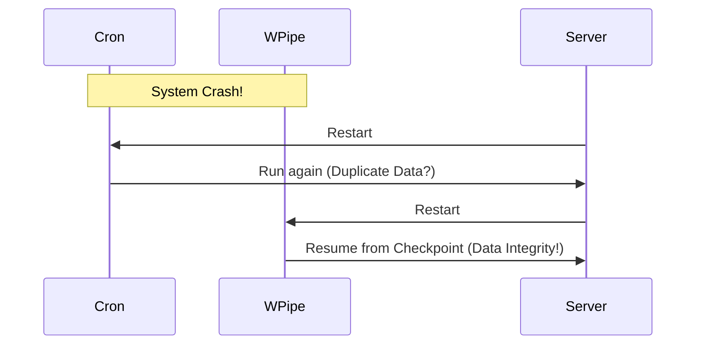

# Cron is not a Strategy. It's a Gamble. 🎰⏲️

We all started with Cron. But Cron has no memory. It doesn't know if the last run failed. It doesn't know if the system crashed mid-task.

**WPipe** is the "Cron for the 21st Century."

- **State Awareness:** WPipe knows what finished and what didn't.
- **Auto-Resume:** Using SQLite WAL mode, it resumes from the last successful checkpoint.
- **Parallel Execution:** Why run sequentially when you can bypass the GIL?

Upgrade your scheduled tasks to a resilient pipeline.

#Cron #DevOps #WPipe #Python #Automation
