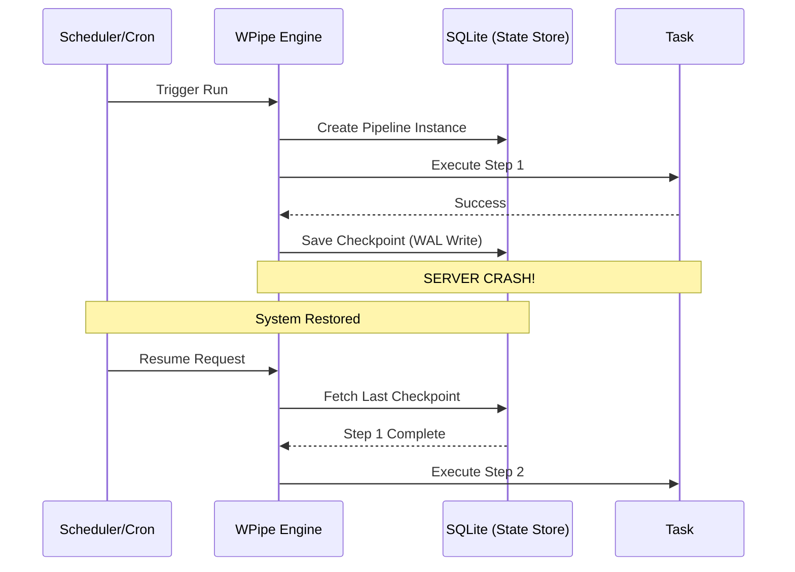

# The Cron Gamble: Why "Scheduling" is Not Enough for Modern Pipelines

## The Silent Failure of the Cron Job

For decades, `crontab -e` has been the first line of defense for automation. It’s simple, it’s ubiquitous, and it’s almost always the wrong tool for critical business logic. 

Why? Because Cron has **no memory**. 

Cron lives in a state of perpetual amnesia. It wakes up at 3:00 AM, fires off a command, and goes back to sleep. It doesn't care if the previous run is still going (leading to race conditions). It doesn't care if the command failed (leaving your data in an inconsistent state). And it certainly doesn't care if the server crashed halfway through (resulting in data loss).

If you are still using Cron for anything more complex than "clear the /tmp folder," you are gambling with your system’s integrity.

---

## From Scheduling to Orchestration: The WPipe Evolution

WPipe was built to solve the "Cron Problem" without introducing the "Airflow Complexity." It provides the **State Awareness** that Cron lacks, with the **Lightweight Footprint** that Cron users love.

### 1. The Concept of "State"
In a Cron job, the only state is the exit code. In WPipe, every execution is a **Pipeline Instance** with its own context. This context is persisted using **SQLite Checkpoints**.

### 2. Handling the "Mid-Run Crash"
Imagine a script that processes 1,000 invoices. It fails at invoice 500 because of a network timeout.
- **Cron's solution:** It runs again tomorrow at 3:00 AM. It either starts from scratch (processing 500 duplicates) or skips the first 500 if you've written custom, complex tracking logic.
- **WPipe's solution:** It identifies the failure. Using the `@state` decorator, it has already checkpointed the state after invoice 499. When the system is restored, WPipe **automatically resumes** from invoice 500.

---

## Deep Dive: How WPipe Achieves Resiliency

WPipe’s resilience isn't magic; it's engineering. It uses **SQLite WAL (Write-Ahead Logging)** to ensure that state transitions are atomic and durable.

### Resource Efficiency: < 50MB RAM
One of the main reasons people stick with Cron is that it’s "free" in terms of resources. Heavy orchestrators like Airflow or Prefect can’t run on a small VPS with 512MB of RAM.

WPipe can. With a memory footprint of **less than 50MB**, WPipe provides industrial-grade orchestration on hardware that would choke a standard Java or Node.js application.

---

## 117k Downloads: The Community Consensus

The massive adoption of WPipe isn't just a fluke. It's a response to the need for **sane automation**. 

Modern developers want:
- **@state Decorators:** No more boilerplate.
- **Pure Python:** No YAML, no DSLs.
- **Parallelism:** Native support for CPU and I/O bound tasks without complex worker fleets.

---

## Moving Beyond the Gamble

If your business relies on scheduled tasks, you cannot afford the amnesia of Cron. You need a system that remembers, a system that resumes, and a system that respects your hardware resources.

WPipe is the logical successor to Cron. It's the professional way to ensure that "scheduled" actually means "completed."

Stop gambling. Start orchestrating.

#DevOps #Cron #Python #WPipe #Resilience #BackendDevelopment
