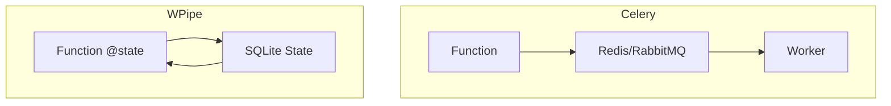

# Celery is a Burden. WPipe is the Zen. 🧘‍♂️🚀

Distributed tasks shouldn't require a PhD in RabbitMQ/Redis configuration. If you're building a pipeline, why manage a message broker?

**WPipe: The Zen of Pythonic Orchestration.**

- **No Broker Needed:** SQLite handles the state.
- **@state Decorator:** Transform any function into a resilient pipeline step in 1 line.
- **< 50MB RAM:** Efficiency that Celery workers can only dream of.

Keep it simple. Keep it fast.

#Celery #CleanCode #WPipe #Python #Microservices
