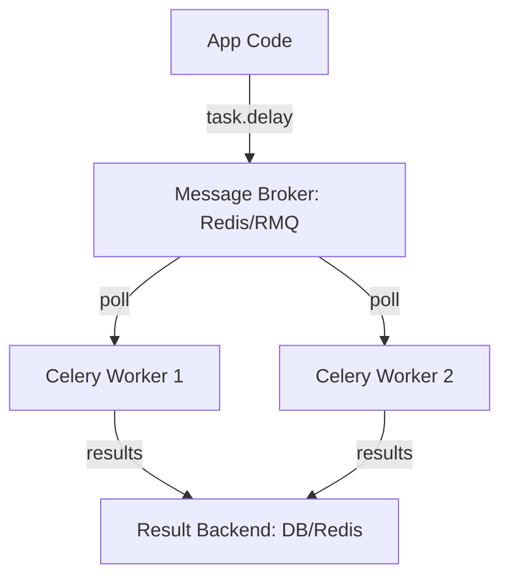
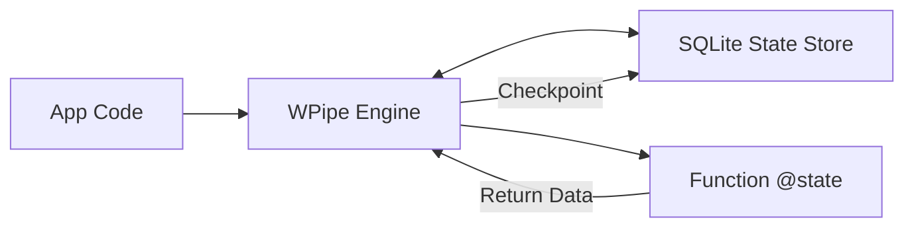

# The Death of the Message Broker: Why WPipe is Replacing Celery for Pipeline Orchestration

## The Over-Engineered Distributed Task

For years, if you wanted to run background tasks in Python, the answer was always "Celery." It was the industry standard, and for good reason—it handled distributed workers, task queues, and retries with maturity. But Celery also brought a silent partner to your architecture: **The Broker**.

Whether you chose Redis or RabbitMQ, you were suddenly responsible for managing a whole new piece of infrastructure. You had to worry about memory limits, connection pools, visibility timeouts, and the dreaded "Lost Task" scenarios. For many developers, the goal was just to run a sequence of Python functions reliably. Instead, they ended up as amateur RabbitMQ administrators.

**WPipe** is here to say: **You don't need a broker to build a resilient pipeline.**

---

## The Zen of WPipe: Pure Python, Zero Overhead

WPipe was built on the principle that orchestration should be a library, not a platform. By leveraging the **`@state` decorator** (the cleaner alias for `@step`), WPipe allows you to transform any standard Python function into a tracked, checkpointed, and resilient pipeline step.

### 1. No Infrastructure Required
While Celery workers are constantly polling a broker, consuming RAM and network bandwidth, WPipe operates **in-process**. It uses an optimized **SQLite backend (WAL mode)** to manage state. This means your "queue" is actually a high-performance local database. 

### 2. The @state Advantage
In Celery, you define a task and then "delay" or "apply_async" it. In WPipe, you define your logic and let the orchestrator handle the flow.

```python
from wpipe import Pipeline, state

@state(name="fetch_user", retry_count=3)
def fetch(ctx):
    # Logic here
    return {"user_id": 123}

@state(name="send_email")
def notify(ctx):
    # Logic here
    return {"status": "sent"}

pipeline = Pipeline(pipeline_name="user_onboarding")
pipeline.set_steps([fetch, notify])
pipeline.run({})
```

No broker configuration. No `celery -A tasks worker --loglevel=info`. Just your code.

---

## Architecture Comparison: Complexity vs. Simplicity

### Celery's Multi-Tier Architecture
In Celery, a single task execution involves at least three independent systems communicating over the network.



### WPipe's Atomic Architecture
In WPipe, the execution and the state management are tightly integrated, reducing latency and infrastructure points of failure.



---

## Performance: < 50MB RAM vs. The Celery "Bloat"

A standard Celery worker, even when idle, typically consumes 150MB-300MB of RAM. Multiply that by your number of workers, and add the memory footprint of your broker (Redis), and you're looking at a significant resource bill.

WPipe runs in **less than 50MB of RAM**. This isn't just a optimization; it's a paradigm shift. It allows you to run complex, multi-step pipelines on tiny containers or edge devices where Celery simply wouldn't fit.

---

## 117k Downloads: The Rise of "Sane" Orchestration

With over 117,000 downloads, WPipe is rapidly becoming the go-to choice for developers who value **Clean Code** over "Big Tech" complexity. 

The community has realized that for 90% of use cases—data processing, API orchestration, automation—distributed brokers are an unnecessary burden. What developers actually want is **Resilience**. And WPipe delivers that through its local SQLite checkpoints. If your process dies, WPipe knows exactly where it was. It doesn't need a broker to tell it.

---

## Conclusion: Reclaiming the Zen

The "Zen of Python" tells us that "Simple is better than complex." Celery is complex. WPipe is simple. 

By removing the broker, WPipe allows you to focus on what matters: your business logic. It provides the resilience of a distributed system with the simplicity of a single library.

It's time to stop managing infrastructure and start writing code. 

#Celery #Python #WPipe #CleanCode #Microservices #SoftwareEngineering
