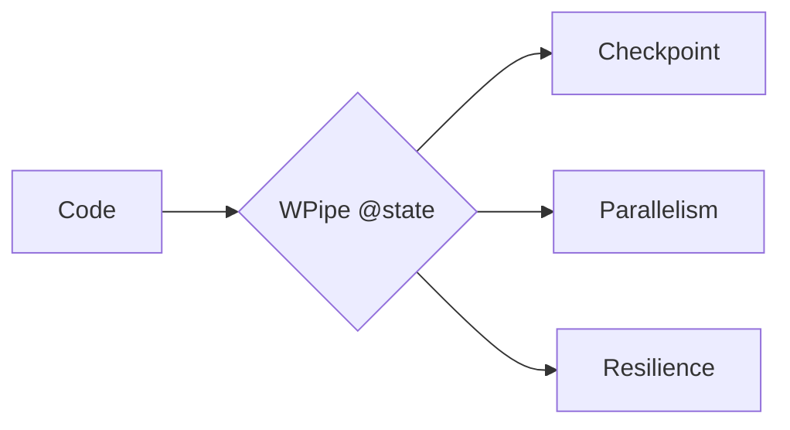

# Prefect "Flows" are nice. WPipe "States" are better. 🌊💎

Prefect introduced a great way to handle workflows, but it often feels like you're building *for* the orchestrator rather than *with* your code.

**WPipe** returns the control to the developer.

- **Pure Python:** No complex abstractions. Just your logic and the `@state` decorator.
- **SQLite Checkpoints:** Built-in persistence without external cloud dependencies.
- **Parallel & Async:** Native support for `Pipeline` and `PipelineAsync` with 100% parity.

Achieve the Zen of Clean Code.

#Prefect #DataScience #CleanCode #WPipe #Python
