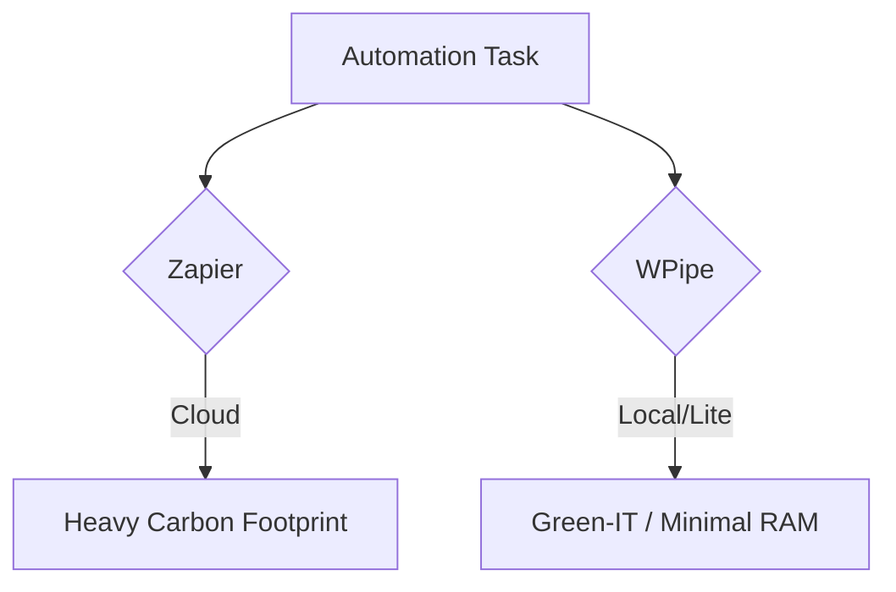

# The Green-IT Choice: Zapier vs. WPipe 🌿⚡

Every Zap costs energy and money. Cloud-heavy automation is the "Gas Guzzler" of the digital age.

**WPipe is the Electric Vehicle of Pipelines.**

- **Ultra-Low Memory:** < 50MB RAM.
- **Local First:** Run it on-prem or in tiny containers. No heavy cloud overhead.
- **High Performance:** Parallel execution that doesn't burn your CPU (or your wallet).

Save the planet. Save your budget. Use WPipe.

#GreenIT #Sustainability #Zapier #WPipe #EcoFriendly
