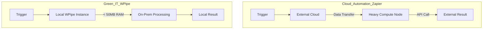

# The Carbon Cost of Cloud Automation: Why WPipe is the Green-IT Alternative to Zapier

## The Invisible Footprint

We often think of digital automation as "clean." We replace paper trails with API calls and manual labor with automated "Zaps." But every time a Zapier workflow triggers, it kicks off a chain reaction in a massive, energy-hungry data center. It consumes cloud compute, burns network bandwidth, and generates a tiny but measurable carbon footprint. 

When you scale this to thousands of "Zaps" per day, you're no longer just "automating"; you're contributing to the growing energy crisis of the cloud. This is the hidden cost of the "Low-Code" revolution. 

**WPipe** offers a different path: **Local-First, Green-IT Orchestration.**

---

## Efficiency as a First-Class Citizen

While platforms like Zapier are built for "ease of use" at any cost, WPipe is built for **efficiency**. This isn't just about saving money (though it does that too); it's about reducing the digital footprint of your operations.

### 1. The < 50MB RAM Revolution
Most cloud-native orchestrators are "RAM-hungry." They run in heavy Node.js or Java environments that require hundreds of megabytes just to maintain a heartbeat. 

WPipe, written in pure Python and optimized with a **SQLite WAL-mode core**, runs in **less than 50MB of RAM**. This allows it to run on the "scraps" of your existing hardware. You don't need a new server; you just need a tiny slice of your existing one.

### 2. Local-First = Network-Light
Zapier requires your data to travel to their servers, be processed, and travel back to another API. This constant back-and-forth is not just a security risk; it's a waste of energy. 

WPipe runs **where your data is**. If you're processing local files or on-prem databases, WPipe stays on-site. No unnecessary data transfer. No "Cloud Tax."

---

## Architecture: The Green vs. The Guzzler

---

## Resilience Without Redundancy

In the cloud world, resilience often means "more servers." If a task fails, you spin up another instance. This "Throw Hardware at the Problem" approach is the antithesis of Green-IT.

**WPipe** uses **SQLite Checkpoints**. Instead of relying on redundant, power-hungry clusters, WPipe uses the simplicity of your local disk. By checkpointing the state after every `@state` (or `@step`), WPipe ensures that if your system fails, it resumes exactly where it stopped. It doesn't waste energy re-running successful tasks. It doesn't "loop" in failure. It is deterministic and efficient.

---

## 117k Downloads: The Sustainable Choice

With over 117,000 downloads, the WPipe community is leading the way in sustainable software engineering. Developers are realizing that "High Performance" shouldn't mean "High Resource."

By choosing WPipe over Zapier, you are:
- **Reducing Carbon Emissions:** Minimizing cloud compute usage.
- **Lowering Costs:** Eliminating per-execution fees.
- **Improving Security:** Keeping your data local.
- **Ensuring Resiliency:** Using SQLite-backed checkpoints for guaranteed completion.

---

## Conclusion: Engineering for the Future

The "Efficiency Era" is here. We can no longer afford to be reckless with our digital resources. Tools like Zapier served their purpose in the "Cloud Land-Rush" era, but for the modern, responsible developer, **WPipe** is the only logical choice.

It’s fast. It’s resilient. It’s pure Python. And most importantly, it’s Green.

Are you ready to make the sustainable switch?

#GreenIT #Sustainability #Zapier #WPipe #Python #EcoFriendly #Efficiency
