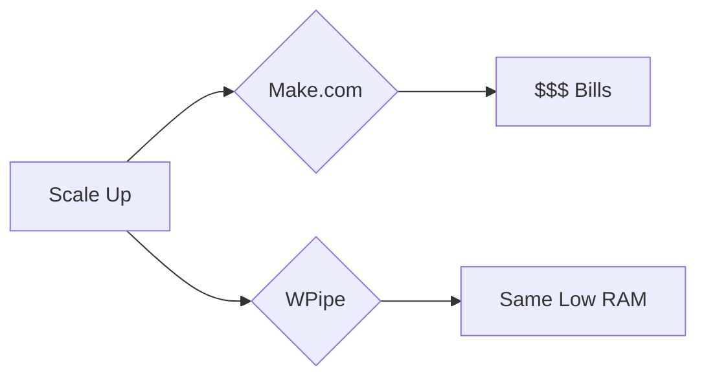

# Make (Integromat) is Expensive. WPipe is Efficient. 💸🌿

Paying per execution? That's old school. 

**WPipe** allows you to scale without scaling your costs.

- **Unlimited Executions:** It's your code, on your hardware.
- **Efficiency:** Optimized SQLite WAL mode means minimal disk I/O and near-zero idle RAM.
- **Resilience:** If your local machine reboots, WPipe resumes. Make just "fails."

Choose the Green-IT path. Choose WPipe.

#MakeCom #Automation #WPipe #Efficiency #CostSaving
