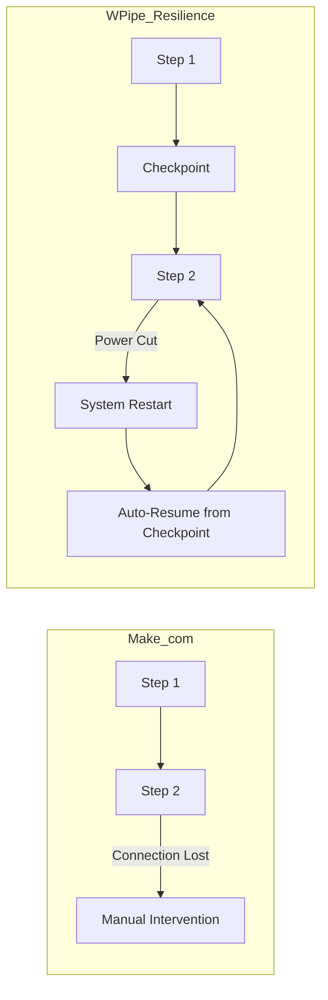

# Scaling Without the Bill: Why WPipe is the Economical and Ecological Choice Over Make.com

## The Success Tax of Low-Code

Make.com (formerly Integromat) is a powerful tool. Its visual builder is intuitive, and its integrations are vast. But Make.com, like many SaaS platforms, imposes a "Success Tax." As your business grows and your automations run more frequently, your monthly bill grows exponentially. You're penalized for being efficient.

Furthermore, every execution on Make.com happens in their cloud infrastructure, contributing to a centralized energy consumption model that is becoming increasingly unsustainable. 

**WPipe** challenges this model by providing a **Code-First, Resource-Light** alternative that scales with your logic, not your wallet.

---

## The Economics of Efficiency

### 1. Unlimited Executions
Because WPipe is a library you run on your own hardware, there is no "per-execution" fee. Whether you run your pipeline once a day or once a second, the cost is the same: the minimal electricity your hardware consumes. 

### 2. The < 50MB RAM Advantage
Most developers believe they need a dedicated VPS to run an orchestrator. With WPipe, you don't. Because it consumes **less than 50MB of RAM**, you can "tuck it away" in a corner of your existing web server, your database host, or even a Raspberry Pi. 

This level of efficiency allows for a "Sidecar" orchestration model that is impossible with heavy, Node-based tools like Make.com.

---

## Technical Resilience: SQLite WAL Mode

Make.com handles failure by either stopping the execution or sending you an email. If their server has a hiccup, your data might be left in a "Partial" state.

**WPipe** is built for **Resilience by Design**. By using **SQLite in Write-Ahead Logging (WAL) mode**, WPipe ensures that every state transition is durable. 

---

## The Green-IT Mandate

In the Green-IT world, the most sustainable server is the one you already have. By not requiring new, dedicated infrastructure, WPipe minimizes the "Embedded Carbon" of your operations. 

- **Pure Python:** No heavy runtimes or complex dependency chains.
- **Parallel Execution:** Optimize your CPU usage by running I/O and CPU-bound tasks concurrently, reducing the total time your server needs to be at "Full Load."
- **SQLite Efficiency:** Minimal disk I/O compared to heavy relational databases.

---

## 117k Downloads: The Power of Code

With 117,000+ downloads, WPipe is proving that developers want more than just "drag-and-drop." They want **control, performance, and sustainability**. 

Using the **`@state` decorator**, WPipe developers can build complex, nested pipelines that are as readable as they are resilient. No more digging through nested visual menus to find a hidden variable. It's all in the code.

---

## Conclusion: A More Sustainable Path

Make.com is a great tool for prototyping. But when you're ready to scale, when you're ready to be serious about your costs, and when you're ready to be a responsible digital citizen, **WPipe** is the answer.

Don't let your success be your biggest expense. Choose the Green-IT, Code-First path with WPipe.

#MakeCom #Automation #WPipe #Efficiency #GreenIT #Python #CostControl
