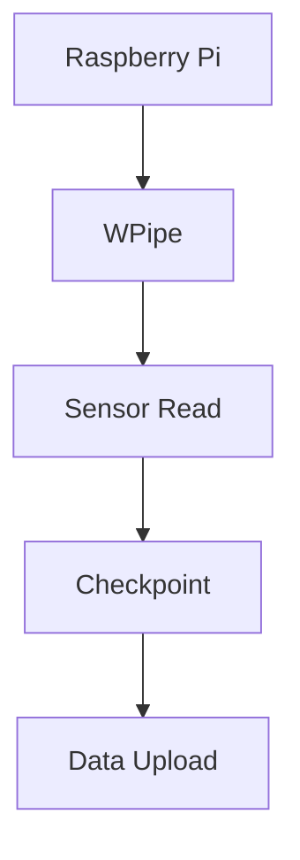

# Running Pipelines on a Raspberry Pi? Yes, you can. 🥧🐍

Most orchestrators crash a Raspberry Pi. WPipe loves it.

- **< 50MB RAM:** Leaving plenty of room for your actual processing.
- **SQLite Persistence:** Perfect for SD-card based systems.
- **Reliable:** Handles power cuts with automatic checkpoints.

The ultimate tool for Edge Computing and IoT.

#RaspberryPi #IoT #EdgeComputing #WPipe #Python
