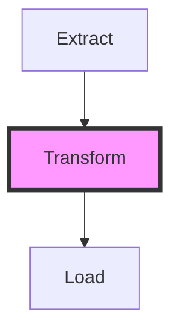

# Stop Writing Docs. Let your Pipelines describe themselves. 📖✨

Dagster tried to solve the documentation problem with "Software Defined Assets." WPipe solves it with **Auto-Visualizing States**.

- **Mermaid Integration:** Your pipelines generate their own diagrams.
- **Clean Syntax:** `@state` defines the intent, WPipe handles the graph.
- **Traceability:** Know exactly where your data came from and where it's going.

Self-documenting code is no longer a myth.

#Dagster #Documentation #CleanCode #WPipe #Python
