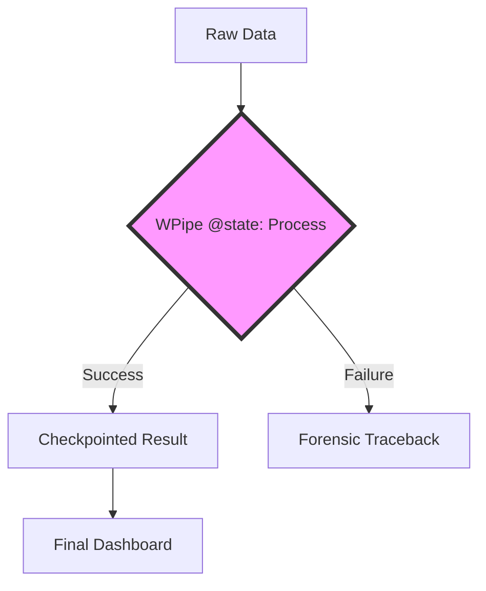

# The Self-Documenting Pipeline: Why WPipe’s Mermaid Integration is the Future of Data Engineering

## The Documentation Debt

In the fast-paced world of data engineering, documentation is usually the first casualty. We build complex DAGs, weave together intricate data flows, and then "promise" to write the README later. Months later, when a pipeline fails, the original architect is gone, and the remaining team is left staring at a "Black Box" of code.

Dagster tried to solve this with "Software Defined Assets," shifting the focus from tasks to the data produced. It was a step forward, but it introduced a new level of abstraction and a significant learning curve. 

**WPipe** offers a more direct, elegant solution: **Auto-Visualizing States**.

---

## Code is Documentation: The WPipe Philosophy

WPipe was built on the belief that if you write clean, Pythonic code, the orchestrator should be smart enough to document it for you. By using the **`@state` decorator**, you aren't just defining a step; you are defining a node in a self-documenting graph.

### 1. The Mermaid Integration
WPipe natively supports **Mermaid.js**. This means your pipelines can generate their own architectural diagrams in real-time. No more manual drawing in Lucidchart or Miro. Your code *is* the diagram.

### 2. Clarity Over Abstraction
While Dagster requires you to think in terms of "Assets" and "I/O Managers," WPipe allows you to think in terms of **Logic and Flow**. It provides the visual clarity of a DAG without forcing you to learn a new paradigm.

---

## Resilience and Visibility

A pipeline you can't see is a pipeline you can't trust. Dagster provides a beautiful UI, but it requires a heavy backend to run it. 

**WPipe** provides the same level of visibility with a fraction of the resources. With its **< 50MB RAM** footprint, WPipe can generate its state-flow diagrams on the fly, even on low-powered edge devices.

### SQLite: The Silent Auditor
By using **SQLite in WAL mode**, WPipe keeps a perfect audit trail of every state transition. This isn't just for resilience (though it enables automatic resumption); it's for **accountability**. You can look at the SQLite store and see exactly what happened, when it happened, and what the data looked like at that moment.

---

## Comparison: Dagster vs. WPipe

| Feature | Dagster | WPipe |
| :--- | :---: | :---: |
| **Learning Curve** | High (Asset-based) | Low (Pythonic) |
| **Footprint** | > 500MB RAM | < 50MB RAM |
| **Documentation** | Software Defined Assets | Mermaid Auto-Docs |
| **Resilience** | Heavy DB Backend | SQLite Checkpoints |
| **Setup** | Complex | `pip install wpipe` |

---

## 117k Downloads: The Community has Spoken

With over 117,000 downloads, WPipe is proving that developers value **simplicity and visibility**. They don't want to spend their days writing documentation; they want their code to document itself. 

Using WPipe, you get:
- **Instant Visualization:** Mermaid diagrams from your code.
- **Pure Python Control:** No complex abstractions.
- **Deterministic Resilience:** SQLite-backed checkpoints.

---

## Conclusion: The End of the Black Box

The era of "Black Box" pipelines is over. With tools like WPipe, documentation is no longer a chore—it’s a byproduct of good engineering. By using the `@state` decorator and our native Mermaid integration, you are building pipelines that are as easy to understand as they are to run.

Stop writing docs. Start writing WPipe.

#Dagster #DataEngineering #Documentation #WPipe #CleanCode #Python #MermaidJS
