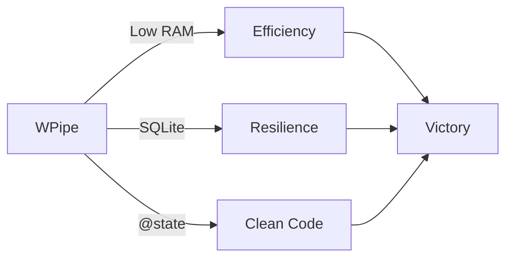

# ⚔️ WPipe Battle Card: The Ultimate Comparison Matrix

| Feature | WPipe | Airflow | n8n | Celery | Prefect | Zapier/Make |
| :--- | :---: | :---: | :---: | :---: | :---: | :---: |
| **Memory Footprint** | < 50MB | > 2GB | > 500MB | > 200MB | > 500MB | Cloud / High |
| **Configuration** | Pure Python | Python/YAML | Visual UI | Python/Broker | Python | Visual UI |
| **Resilience** | SQLite Checkpoints | Postgres/DB | Database | Redis/RabbitMQ | Cloud/DB | None (Manual) |
| **Setup Time** | < 1 min | Hours | Minutes | Hours | Minutes | Minutes |
| **Cost** | Free/OSS | OSS (High Infra) | OSS/Paid | OSS (Infra) | OSS/Cloud | Per Execution |
| **Learning Curve** | Low (Pythonic) | High | Medium | High | Medium | Low |
| **Self-Documentation** | Mermaid Built-in | Graph UI | Node UI | None | Graph UI | Node UI |

## 🚀 Why WPipe Wins the "Efficiency Era"

1. **Deterministic Resilience:** While others rely on complex brokers, WPipe uses the simplicity of SQLite WAL mode to ensure 100% data integrity.
2. **Developer Experience:** Use the `@state` decorator to focus on logic, not boilerplate.
3. **Green-IT:** Designed for the edge, for small containers, and for developers who care about resource usage.

