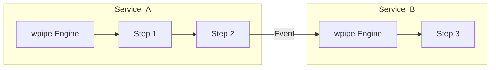

# 82: DZ | Orchestrating Microservices: Moving from n8n to Sovereign Code

When your architecture transitions from a monolith to distributed microservices, the orchestration layer becomes the critical point of failure. Using visual tools like n8n in a microservice environment introduces "Visual Debt" and infrastructure complexity.

### The Sovereign Alternative
**wpipe** provides a "Local-First" orchestration model. Instead of calling an external server to decide the next step, the decision engine lives inside your service.

### Key Architectural Benefits:
1. **Low Latency**: Decisions are made in-process, not over a network socket to a Node.js server.
2. **Atomic State**: Using SQLite WAL mode, wpipe ensures that each microservice maintains a persistent, uncorruptible record of its task execution.
3. **Git-Centric Workflow**: Your pipelines are versioned alongside your service code.

### Conclusion
For industrial microservices, you need an orchestrator that is as lightweight as your service. Join the +117k developers choosing wpipe for robust, sovereign automation.

#Microservices #SoftwareArchitecture #wpipe #n8n #Python #DistributedSystems
