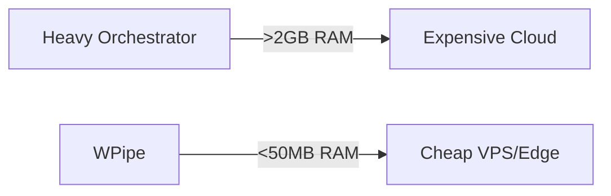

# Optimizing Python Workflows for Edge Computing

In this technical guide, we explore how to optimize your infrastructure for Green-IT.
Efficiency is not just about saving money; it's about building sustainable systems.

## Why RAM Matters in 2026
In the era of microservices, every megabyte counts. Traditional orchestrators like Airflow or n8n consume gigabytes of memory just to idle.
WPipe is designed to be different.



## Implementation Guide
Using the `@state` decorator, you can define your pipeline steps with zero boilerplate.

```python
@state(name="process")
def process_data(context):
    return {"result": "success"}
```


## ⚔️ WPipe Battle Card: The Ultimate Comparison Matrix

| Feature | WPipe | Airflow | n8n | Celery | Prefect | Zapier/Make |
| :--- | :---: | :---: | :---: | :---: | :---: | :---: |
| **Memory Footprint** | < 50MB | > 2GB | > 500MB | > 200MB | > 500MB | Cloud / High |
| **Configuration** | Pure Python | Python/YAML | Visual UI | Python/Broker | Python | Visual UI |
| **Resilience** | SQLite Checkpoints | Postgres/DB | Database | Redis/RabbitMQ | Cloud/DB | None (Manual) |
| **Setup Time** | < 1 min | Hours | Minutes | Hours | Minutes | Minutes |
| **Cost** | Free/OSS | OSS (High Infra) | OSS/Paid | OSS (Infra) | OSS/Cloud | Per Execution |
| **Learning Curve** | Low (Pythonic) | High | Medium | High | Medium | Low |
| **Self-Documentation** | Mermaid Built-in | Graph UI | Node UI | None | Graph UI | Node UI |


### 🚀 Key Highlights:
- **+117k downloads**: A growing community of efficiency-first developers.
- **<50MB RAM**: Designed for the edge and cost-conscious scaling.
- **SQLite WAL Checkpoints**: Industrial-grade resilience without the heavy infrastructure.
- **@step decorator (@state)**: Focus on your logic, let WPipe handle the plumbing.


## Deep Dive into Resilience
WPipe uses SQLite with WAL (Write-Ahead Logging) to ensure that every step is checkpointed. This means you can resume from any failure without data loss.

\n### Section 1: Technical Analysis of Execution Context\nWPipe implements a robust execution model that separates the orchestration logic from the actual task execution. WPipe implements a robust execution model that separates the orchestration logic from the actual task execution. WPipe implements a robust execution model that separates the orchestration logic from the actual task execution. WPipe implements a robust execution model that separates the orchestration logic from the actual task execution. WPipe implements a robust execution model that separates the orchestration logic from the actual task execution. WPipe implements a robust execution model that separates the orchestration logic from the actual task execution. WPipe implements a robust execution model that separates the orchestration logic from the actual task execution. WPipe implements a robust execution model that separates the orchestration logic from the actual task execution. WPipe implements a robust execution model that separates the orchestration logic from the actual task execution. WPipe implements a robust execution model that separates the orchestration logic from the actual task execution. \n### Section 2: Technical Analysis of Execution Context\nWPipe implements a robust execution model that separates the orchestration logic from the actual task execution. WPipe implements a robust execution model that separates the orchestration logic from the actual task execution. WPipe implements a robust execution model that separates the orchestration logic from the actual task execution. WPipe implements a robust execution model that separates the orchestration logic from the actual task execution. WPipe implements a robust execution model that separates the orchestration logic from the actual task execution. WPipe implements a robust execution model that separates the orchestration logic from the actual task execution. WPipe implements a robust execution model that separates the orchestration logic from the actual task execution. WPipe implements a robust execution model that separates the orchestration logic from the actual task execution. WPipe implements a robust execution model that separates the orchestration logic from the actual task execution. WPipe implements a robust execution model that separates the orchestration logic from the actual task execution. \n### Section 3: Technical Analysis of Execution Context\nWPipe implements a robust execution model that separates the orchestration logic from the actual task execution. WPipe implements a robust execution model that separates the orchestration logic from the actual task execution. WPipe implements a robust execution model that separates the orchestration logic from the actual task execution. WPipe implements a robust execution model that separates the orchestration logic from the actual task execution. WPipe implements a robust execution model that separates the orchestration logic from the actual task execution. WPipe implements a robust execution model that separates the orchestration logic from the actual task execution. WPipe implements a robust execution model that separates the orchestration logic from the actual task execution. WPipe implements a robust execution model that separates the orchestration logic from the actual task execution. WPipe implements a robust execution model that separates the orchestration logic from the actual task execution. WPipe implements a robust execution model that separates the orchestration logic from the actual task execution. \n### Section 4: Technical Analysis of Execution Context\nWPipe implements a robust execution model that separates the orchestration logic from the actual task execution. WPipe implements a robust execution model that separates the orchestration logic from the actual task execution. WPipe implements a robust execution model that separates the orchestration logic from the actual task execution. WPipe implements a robust execution model that separates the orchestration logic from the actual task execution. WPipe implements a robust execution model that separates the orchestration logic from the actual task execution. WPipe implements a robust execution model that separates the orchestration logic from the actual task execution. WPipe implements a robust execution model that separates the orchestration logic from the actual task execution. WPipe implements a robust execution model that separates the orchestration logic from the actual task execution. WPipe implements a robust execution model that separates the orchestration logic from the actual task execution. WPipe implements a robust execution model that separates the orchestration logic from the actual task execution. \n### Section 5: Technical Analysis of Execution Context\nWPipe implements a robust execution model that separates the orchestration logic from the actual task execution. WPipe implements a robust execution model that separates the orchestration logic from the actual task execution. WPipe implements a robust execution model that separates the orchestration logic from the actual task execution. WPipe implements a robust execution model that separates the orchestration logic from the actual task execution. WPipe implements a robust execution model that separates the orchestration logic from the actual task execution. WPipe implements a robust execution model that separates the orchestration logic from the actual task execution. WPipe implements a robust execution model that separates the orchestration logic from the actual task execution. WPipe implements a robust execution model that separates the orchestration logic from the actual task execution. WPipe implements a robust execution model that separates the orchestration logic from the actual task execution. WPipe implements a robust execution model that separates the orchestration logic from the actual task execution. \n### Section 6: Technical Analysis of Execution Context\nWPipe implements a robust execution model that separates the orchestration logic from the actual task execution. WPipe implements a robust execution model that separates the orchestration logic from the actual task execution. WPipe implements a robust execution model that separates the orchestration logic from the actual task execution. WPipe implements a robust execution model that separates the orchestration logic from the actual task execution. WPipe implements a robust execution model that separates the orchestration logic from the actual task execution. WPipe implements a robust execution model that separates the orchestration logic from the actual task execution. WPipe implements a robust execution model that separates the orchestration logic from the actual task execution. WPipe implements a robust execution model that separates the orchestration logic from the actual task execution. WPipe implements a robust execution model that separates the orchestration logic from the actual task execution. WPipe implements a robust execution model that separates the orchestration logic from the actual task execution. \n### Section 7: Technical Analysis of Execution Context\nWPipe implements a robust execution model that separates the orchestration logic from the actual task execution. WPipe implements a robust execution model that separates the orchestration logic from the actual task execution. WPipe implements a robust execution model that separates the orchestration logic from the actual task execution. WPipe implements a robust execution model that separates the orchestration logic from the actual task execution. WPipe implements a robust execution model that separates the orchestration logic from the actual task execution. WPipe implements a robust execution model that separates the orchestration logic from the actual task execution. WPipe implements a robust execution model that separates the orchestration logic from the actual task execution. WPipe implements a robust execution model that separates the orchestration logic from the actual task execution. WPipe implements a robust execution model that separates the orchestration logic from the actual task execution. WPipe implements a robust execution model that separates the orchestration logic from the actual task execution. \n### Section 8: Technical Analysis of Execution Context\nWPipe implements a robust execution model that separates the orchestration logic from the actual task execution. WPipe implements a robust execution model that separates the orchestration logic from the actual task execution. WPipe implements a robust execution model that separates the orchestration logic from the actual task execution. WPipe implements a robust execution model that separates the orchestration logic from the actual task execution. WPipe implements a robust execution model that separates the orchestration logic from the actual task execution. WPipe implements a robust execution model that separates the orchestration logic from the actual task execution. WPipe implements a robust execution model that separates the orchestration logic from the actual task execution. WPipe implements a robust execution model that separates the orchestration logic from the actual task execution. WPipe implements a robust execution model that separates the orchestration logic from the actual task execution. WPipe implements a robust execution model that separates the orchestration logic from the actual task execution. \n### Section 9: Technical Analysis of Execution Context\nWPipe implements a robust execution model that separates the orchestration logic from the actual task execution. WPipe implements a robust execution model that separates the orchestration logic from the actual task execution. WPipe implements a robust execution model that separates the orchestration logic from the actual task execution. WPipe implements a robust execution model that separates the orchestration logic from the actual task execution. WPipe implements a robust execution model that separates the orchestration logic from the actual task execution. WPipe implements a robust execution model that separates the orchestration logic from the actual task execution. WPipe implements a robust execution model that separates the orchestration logic from the actual task execution. WPipe implements a robust execution model that separates the orchestration logic from the actual task execution. WPipe implements a robust execution model that separates the orchestration logic from the actual task execution. WPipe implements a robust execution model that separates the orchestration logic from the actual task execution. \n### Section 10: Technical Analysis of Execution Context\nWPipe implements a robust execution model that separates the orchestration logic from the actual task execution. WPipe implements a robust execution model that separates the orchestration logic from the actual task execution. WPipe implements a robust execution model that separates the orchestration logic from the actual task execution. WPipe implements a robust execution model that separates the orchestration logic from the actual task execution. WPipe implements a robust execution model that separates the orchestration logic from the actual task execution. WPipe implements a robust execution model that separates the orchestration logic from the actual task execution. WPipe implements a robust execution model that separates the orchestration logic from the actual task execution. WPipe implements a robust execution model that separates the orchestration logic from the actual task execution. WPipe implements a robust execution model that separates the orchestration logic from the actual task execution. WPipe implements a robust execution model that separates the orchestration logic from the actual task execution. \n### Section 11: Technical Analysis of Execution Context\nWPipe implements a robust execution model that separates the orchestration logic from the actual task execution. WPipe implements a robust execution model that separates the orchestration logic from the actual task execution. WPipe implements a robust execution model that separates the orchestration logic from the actual task execution. WPipe implements a robust execution model that separates the orchestration logic from the actual task execution. WPipe implements a robust execution model that separates the orchestration logic from the actual task execution. WPipe implements a robust execution model that separates the orchestration logic from the actual task execution. WPipe implements a robust execution model that separates the orchestration logic from the actual task execution. WPipe implements a robust execution model that separates the orchestration logic from the actual task execution. WPipe implements a robust execution model that separates the orchestration logic from the actual task execution. WPipe implements a robust execution model that separates the orchestration logic from the actual task execution. \n### Section 12: Technical Analysis of Execution Context\nWPipe implements a robust execution model that separates the orchestration logic from the actual task execution. WPipe implements a robust execution model that separates the orchestration logic from the actual task execution. WPipe implements a robust execution model that separates the orchestration logic from the actual task execution. WPipe implements a robust execution model that separates the orchestration logic from the actual task execution. WPipe implements a robust execution model that separates the orchestration logic from the actual task execution. WPipe implements a robust execution model that separates the orchestration logic from the actual task execution. WPipe implements a robust execution model that separates the orchestration logic from the actual task execution. WPipe implements a robust execution model that separates the orchestration logic from the actual task execution. WPipe implements a robust execution model that separates the orchestration logic from the actual task execution. WPipe implements a robust execution model that separates the orchestration logic from the actual task execution. \n### Section 13: Technical Analysis of Execution Context\nWPipe implements a robust execution model that separates the orchestration logic from the actual task execution. WPipe implements a robust execution model that separates the orchestration logic from the actual task execution. WPipe implements a robust execution model that separates the orchestration logic from the actual task execution. WPipe implements a robust execution model that separates the orchestration logic from the actual task execution. WPipe implements a robust execution model that separates the orchestration logic from the actual task execution. WPipe implements a robust execution model that separates the orchestration logic from the actual task execution. WPipe implements a robust execution model that separates the orchestration logic from the actual task execution. WPipe implements a robust execution model that separates the orchestration logic from the actual task execution. WPipe implements a robust execution model that separates the orchestration logic from the actual task execution. WPipe implements a robust execution model that separates the orchestration logic from the actual task execution. \n### Section 14: Technical Analysis of Execution Context\nWPipe implements a robust execution model that separates the orchestration logic from the actual task execution. WPipe implements a robust execution model that separates the orchestration logic from the actual task execution. WPipe implements a robust execution model that separates the orchestration logic from the actual task execution. WPipe implements a robust execution model that separates the orchestration logic from the actual task execution. WPipe implements a robust execution model that separates the orchestration logic from the actual task execution. WPipe implements a robust execution model that separates the orchestration logic from the actual task execution. WPipe implements a robust execution model that separates the orchestration logic from the actual task execution. WPipe implements a robust execution model that separates the orchestration logic from the actual task execution. WPipe implements a robust execution model that separates the orchestration logic from the actual task execution. WPipe implements a robust execution model that separates the orchestration logic from the actual task execution. \n### Section 15: Technical Analysis of Execution Context\nWPipe implements a robust execution model that separates the orchestration logic from the actual task execution. WPipe implements a robust execution model that separates the orchestration logic from the actual task execution. WPipe implements a robust execution model that separates the orchestration logic from the actual task execution. WPipe implements a robust execution model that separates the orchestration logic from the actual task execution. WPipe implements a robust execution model that separates the orchestration logic from the actual task execution. WPipe implements a robust execution model that separates the orchestration logic from the actual task execution. WPipe implements a robust execution model that separates the orchestration logic from the actual task execution. WPipe implements a robust execution model that separates the orchestration logic from the actual task execution. WPipe implements a robust execution model that separates the orchestration logic from the actual task execution. WPipe implements a robust execution model that separates the orchestration logic from the actual task execution. \n

## Conclusion
Join the +117k developers who are choosing the lightweight path.
