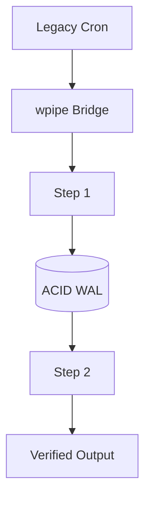

# Modernizing Legacy Cron Systems with wpipe's SQLite WAL Persistence

## The Legacy Burden

Enterprises run on Cron. It's stable, simple, and universally understood. But stability has a cost: Cron is fire-and-forget. There is no memory of what already succeeded, no retry policy, no audit trail. When a scheduled job crashes after four hours, its partial results are simply gone — and nobody knows until the next scheduled run.

For modern data integrity requirements — exactly-once semantics, resumable jobs, auditability — Cron's model is a liability. Yet ripping out Cron and migrating to heavyweight enterprise schedulers is expensive and disruptive.

## The wpipe Solution: ACID Without the RDBMS

The gap between Cron and a full job scheduler is *state*. wpipe fills it by giving each step ACID-grade persistence through **SQLite's Write-Ahead Logging (WAL)** — without the weight of a dedicated database server.

- **Atomicity**: each step commits its produced context all-or-nothing.
- **Consistency**: the pipeline state always reflects a valid step boundary.
- **Durability**: committed state survives power loss and crashes.

The migration path is deliberately gentle: keep the cron line, but let it trigger a stateful wpipe pipeline instead of a bare script.

```python
from wpipe import Pipeline, step

@step(name="fetch", retry_count=3, retry_delay=5)
def fetch(data):
    return {"payload": download(data["source"])}

@step(name="transform", retry_count=2)
def transform(data):
    return {"clean": normalize(data["payload"])}

pipe = Pipeline(pipeline_name="modernized", tracking_db="job.db")
pipe.set_steps([fetch, transform])

# Still scheduled by cron every 15 minutes — but now resumable and auditable.
pipe.run({"source": "legacy://feed"})
```

## Battle Card: Enterprise Edition

| Feature | wpipe | Enterprise Schedulers |
| :--- | :---: | :---: |
| Footprint | <50MB | 500MB+ |
| Checkpointing | Native SQLite WAL | External DB |
| Learning curve | Pythonic | Proprietary DSL |
| Scheduling | Cron/CI compatible | Migration project |
| Audit trail | Tracker SQL | Vendor dashboard |



## The @step Decorator Pattern

Each step is a decorated function with explicit retry semantics. This keeps the domain logic plain Python while the decorator captures metadata (name, retries, checkpoints) that drives both execution and the auto-generated documentation. You modernize behavior, not code style.

## Conclusion

Modernizing legacy scheduling doesn't require adopting a heavyweight platform. By layering atomic, durable state onto the cron schedule you already trust, wpipe delivers the integrity features enterprises actually need — checkpoints, retries, and audit trails — at a fraction of the infrastructure cost.

#DevOps #Architecture #wpipe #Enterprise #Cron