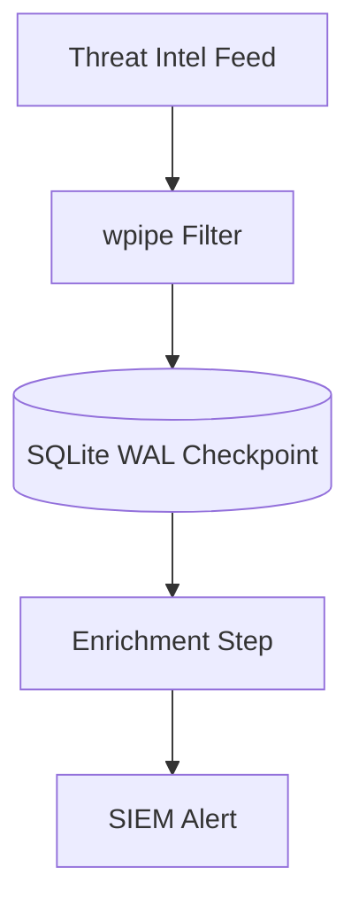

# Orchestrating Threat Intel with <50MB RAM: A wpipe Deep Dive

## The Cybersecurity Challenge

Threat intelligence feeds are voluminous, noisy, and constant. Sensors stream, IOCs arrive by the thousands, and enrichment requires calls to multiple external services. Security orchestration platforms (e.g., Phantom/Demisto-class tools) handle this — but they arrive with heavy footprints (2GB+ RAM), proprietary workflow languages, and infrastructure costs that starve the very teams meant to protect the organization.

Security teams increasingly need the opposite: **lean, transparent, auditable** automation that runs close to the data.

## Enter wpipe: The Lean Security Orchestrator

wpipe frames security automation as a pipeline: ingest → filter → enrich → correlate → escalate. Each stage is a decorated Python step, each transition is atomic, and the whole run is persisted to an auditable tracker.

```python
from wpipe import Pipeline, step

@step(name="ingest_iocs", retry_count=3, retry_delay=1)
def ingest_iocs(data):
    return {"iocs": data["feed"]}

@step(name="enrich", retry_count=2)
def enrich(data):
    return {"enriched": enrich_external(data["iocs"])}

@step(name="escalate")
def escalate(data):
    hits = [i for i in data["enriched"] if i["score"] > 8]
    return {"alerts": hits}

pipe = Pipeline(pipeline_name="threat_intel", tracking_db="tintel.db")
pipe.set_steps([ingest_iocs, enrich, escalate])
pipe.run({"feed": [...]})
```

## Why This Matters in Practice

- **Atomic state transitions**: if enrichment fails on IOC #50, the pipeline resumes at #51 — no re-processing, no lost IOCs.
- **Network timeouts**: `retry_count` / `retry_delay` absorb external API flakiness automatically.
- **RAM discipline**: <50MB means the engine coexists with your SIEM on the same host.
- **Auditability**: every run writes to tracker SQL — what happened, step by step, is a query away.

## Battle Card: Security Edition

| Metric | wpipe | Phantom/Demisto |
| :--- | :---: | :---: |
| RAM | <50MB | 2GB+ |
| Persistence | SQLite WAL | Proprietary / Heavy DB |
| Playbook language | Python | Proprietary |
| Community signal | +117k devs | Enterprise-only |
| Run placement | On-edge, wherever Python runs | Centralized |




## Conclusion

Security orchestration shouldn't be gated behind heavyweight platforms. Processing threat intel with a <50MB, checkpointed, Python-coded engine means better coverage at lower cost — and playbooks that your whole team can review in a pull request.

#Cybersecurity #ThreatIntel #wpipe #Python #SecOps