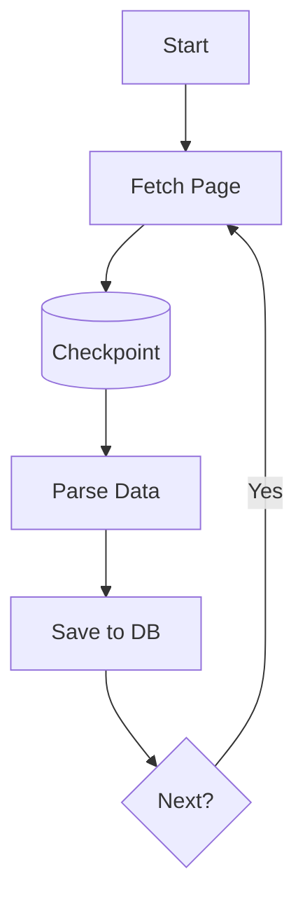

# Resilient Scraping at Scale with wpipe Checkpoints

## The Scraping Nightmare

Scraping is brittle by nature. IP bans, structure changes, and network timeouts are inevitable, and each one interacts with the others: a rate-limit ban triggers 429s, which cascade into freezes that consume more retries. The traditional script blunts this with `try/except` and sleep — and loses everything when it crashes anyway.

At scale, "brittle but running" becomes "brittle and mysteriously failing" — partially-processed pages, no record of progress, and hours of rework on every restart.

## The wpipe Solution: SQLite WAL Checkpoints

wpipe makes **progress the source of truth**. Each fetched-and-parsed page commits its position to a local SQLite store in WAL mode. When the process dies — power loss, IP ban, OOM — the pipeline resumes from the last committed step. Not page one: the exact page where it stopped.

```python
from wpipe import Pipeline, step

@step(name="fetch", retry_count=3, retry_delay=2)
def fetch(data):
    page = get_page(data["url"])          # may 429/500/timeout
    return {"html": page}

@step(name="parse", retry_count=2)
def parse(data):
    return {"items": extract(data["html"])}

@step(name="store", retry_count=3)
def store(data):
    persist(data["items"])                # checkpoint commits here
    return {"saved": len(data["items"])}

pipe = Pipeline(pipeline_name="crawler", tracking_db="crawl.db")
pipe.set_steps([fetch, parse, store])
pipe.run({"url": "https://target.example/page/1"})
```

The `retry_count` swallows transient failures; the checkpoint makes long-term crashes a non-event.

## Battle Card: Scraping Edition

| Feature | wpipe | Scrapy |
| :--- | :---: | :---: |
| Persistence | SQLite WAL | Manual / Extension |
| RAM | <50MB | 150MB+ |
| Visibility | Mermaid auto-docs + tracker | Logs only |
| Resume point | Exact step | Script re-run |
| Failure policy | Declarative retries | Hand-rolled |



## From Script to Production Crawler

Beyond robustness, checkpointing changes your relationship with the crawler:

- **Predictable cost**: a failed run only redoes what it hasn't committed.
- **Auditable**: tracker SQL shows exactly what was fetched, parsed, saved.
- **Composable**: each step is a plain function — unit-testable in isolation.

## Conclusion

Reliable scraping is less about clever retry loops and more about persistent state. By making progress atomic and resumable, wpipe turns a fragile script into a production crawler that survives the network's worst behavior.

#WebScraping #DataEngineering #wpipe #Python #Reliability