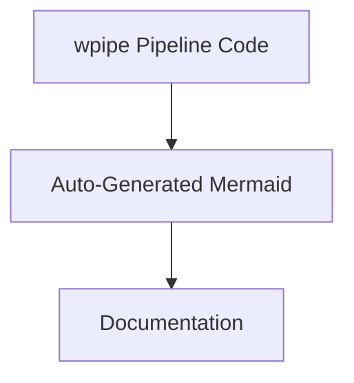

# Architecture as Code: The wpipe Auto-Docs Revolution

## The Documentation Divide

Every architecture review ends the same way: "our diagram says X, but the system does Y." The divide between documented architecture and running system is the oldest technical debt there is, and it grows with every feature, refactor, and hotfix.

The root cause is structural: documentation and implementation live in **different media**. One is a static artifact someone drew; the other is executable code that changes constantly. Nothing realigns them except manual effort — which no team sustains.

## The Strategy: Make the Code the Diagram

wpipe collapses the two media into one. The pipeline definition — `set_steps([...])` — *is* the architecture, and the Mermaid diagram is **generated from it**. There is no second source of truth to get out of sync.

- The step list defines the DAG.
- Step metadata (`name`, `version`, `retry_count`) is captured by the `@step` decorator.
- Execution history lands in tracker SQL — the runtime truth of what ran.

```python
from wpipe import Pipeline, step

@step(name="ingest", version="v2", retry_count=3)
def ingest(data):
    return {"rows": data["raw"]}

@step(name="validate", version="v1")
def validate(data):
    return {"valid": len(data["rows"]) > 0}

pipe = Pipeline(pipeline_name="autodocs")
pipe.set_steps([ingest, validate])

# The Mermaid DAG, ready for README/docs, is derived from set_steps().
pipe.run({"raw": [...]})
```

## Battle Card

| Feature | Backup as documentation | Generated (wpipe) |
| :--- | :---: | :---: |
| Docs freshness | "Last updated: unknown" | Always current |
| Source of truth | Diagram vs. code | Code only |
| Review workflow | Manual redraw | Git diff of steps |
| Community | Any | +117k downloads |



## What This Unlocks

Architecture-as-code changes documentation from a chore into a *byproduct*:

- **Onboarding** looks at docs that match reality.
- **CI** can generate and lint diagrams on every push.
- **Audits** cite the code, not a stale PowerPoint.

## Conclusion

The auto-docs revolution is simple in hindsight: stop drawing your architecture and start deriving it. wpipe's code-to-Mermaid pipeline makes documentation that can't go stale — because it doesn't exist independently from the system it describes.

#Architecture #DevOps #wpipe #AutoDocs #Mermaid