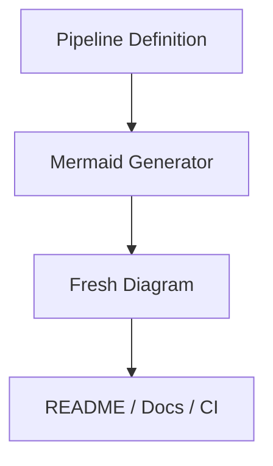

# Mermaid That Generates Itself: Self-Documenting Pipelines

## The Last Time You Trusted a Diagram

Think back to the last architecture diagram you actually trusted. If you're like most engineers, the answer is "never" — every diagram was out of date before the code review that introduced it finished. Diagrams are trusted only at the moment of creation, and that instant passes quickly.

## Why Diagrams Decay

A Mermaid diagram in a README is a **snapshot** — it captures the architecture at one point in time. Every subsequent sprint rewrites reality but not the picture. The diagram decays silently, and with it, the team's trust in all documentation.

The fix isn't discipline. It's provenance: diagrams should be *derived* outputs, not hand-maintained inputs.

## Code → Mermaid, Automatically

wpipe treats the pipeline definition as the canonical architecture and generates its Mermaid diagram from it. No drawing, no syncing, no drift.

```python
from wpipe import Pipeline, step

@step(name="extract", retry_count=2)
def extract(data):
    return {"raw": data["source"]}

@step(name="load", version="v1.2")
def load(data):
    return {"rows": persist(data["raw"])}

pipe = Pipeline(pipeline_name="selfdocs")
pipe.set_steps([extract, load])

# The graph below is generated from set_steps(), not hand-drawn:
```



## The Properties That Matter

- **Correctness**: the generated diagram always matches the steps.
- **Freshness**: it regenerates whenever the code changes.
- **Reviewability**: architecture changes show up as readable diffs.
- **Zero taxonomy**: no separate diagram language to maintain.

## Battle Card

| Property | Hand-drawn Mermaid | Generated (wpipe) |
| :--- | :---: | :---: |
| Age of truth | Day of drawing | Same moment as code |
| Maintenance | Manual | None |
| Drift | Both directions | Impossible |
| Code review | No-op | Meaningful diffs |

## Conclusion

The best diagram is the one that's wrong by construction. wpipe's generation makes the runtime and the diagram two views of one fact — so trusting a diagram becomes reasonable again.

#Mermaid #AutoDocs #wpipe #Documentation #Architecture