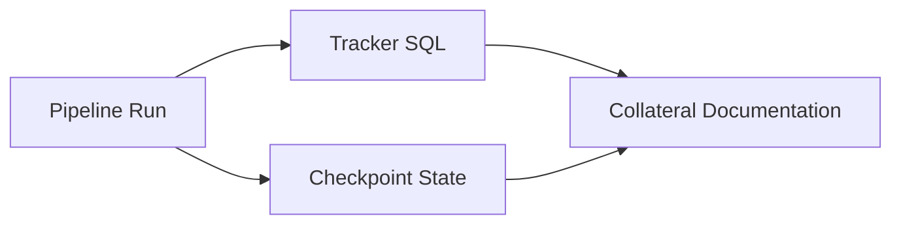

# State as Documentation: Why Checkpoints Are Better Docs Than Diagrams

## The Diagram You Draw vs. The State You Keep

Documentation answers one question better than any other: **what actually happened?** And yet most documentation answers a different, weaker question: *what was supposed to happen?* That's the limitation of hand-drawn diagrams and written READMEs — they describe intent at a frozen moment.

The engineering truth lives in state: what executed, in what order, with what result.

## State Is a Write-Only That Becomes Readable

An orchestrator that persists real state produces the most honest documentation a system can have:

- **Runtime SQL** (tracker): every step executed, every duration, every completion or failure.
- **Checkpoint position**: the exact last committed step — proof of where truth stood.
- **Execution metadata** (name, version, retries) captured by decorators at definition time.

Combine them and you can reconstruct the system's actual behavior — the documentation you'd want during an incident, an audit, or a handover.

```python
from wpipe import Pipeline, step

@step(name="tax_calc", version="v3", retry_count=2)
def tax_calc(data):
    return {"gross": data["amount"] * 1.21}

pipe = Pipeline(pipeline_name="audit", tracking_db="audit.db")
pipe.set_steps([tax_calc])
pipe.run({"amount": 100})

# The tracker now holds: step, version, duration, result.
# That IS documentation — generated by execution.
```

## Battle Card

| Question | Written docs | State (wpipe tracker) |
| :--- | :---: | :---: |
| What *should* run | Yes (frozen) | — |
| What *did* run | Usually no | Yes, per run |
| When did it last work | "Probably" | Timestamped |
| What version ran | Not tracked | In metadata |
| Auditable evidence | No | Queryable SQL |



## State Over Drawings

When a diagram conflicts with the actual state, the state is the truth — it's the record of what the machine really did. For audit, debugging, and handover scenarios, checkpoints and runtime logs consistently beat static pictures.

## Conclusion

Real documentation isn't the picture of the plan; it's the record of the execution. wpipe's checkpoints and tracker make that record automatic, queryable, and authoritative — turning "what happened?" from a mystery into a query.

#State #Documentation #wpipe #Observability #Audit