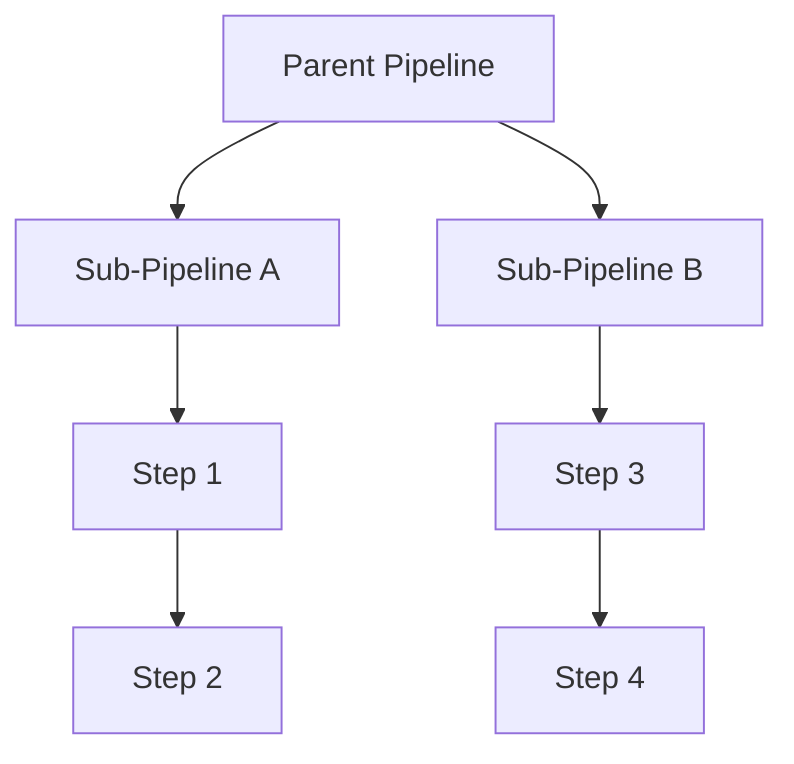

# Pipeline Composition: Building Bigger Systems From Trusted Pieces

## The Monolithic Pipeline Trap

Pipelines grow. What starts as three steps becomes thirty, then a single "loader" do-blade with eight responsibilities and a mounting fear of refactoring. The result is a monolith: hard to read, impossible to test in isolation, and protected from change by nothing but anxiety.

## The Refactor: Pipelines Within Pipelines

The cure is the same composition that tames large codebases: **treat a pipeline as a component**. A pipeline can act as a step inside a larger pipeline — nesting, reuse, and isolation without losing the orchestration view.

wpipe models this directly:

```python
from wpipe import Pipeline, step

inline_part = Pipeline(pipeline_name="inline_clean")
inline_part.set_steps([normalize, dedupe])      # reusable sub-pipeline

batch = Pipeline(pipeline_name="batch_runner")
batch.set_steps([
    extract_items,
    inline_part,        # a pipeline used as a step
    persist_output,
])
```

Each part is a complete, independently-deployable unit; the parent describes the business flow; children hold implementation detail.

## Why Composition Wins

- **Reuse**: one cleaning sub-pipeline serves five parent flows.
- **Isolation**: a bug in `dedupe` is a bug in one small, testable unit.
- **Clarity**: the parent reads like a narrative, not a maze.
- **Resilience scoping**: checkpoints and retries apply to each composed block.

## Battle Card

| Attribute | Monolithic steps | Composed pipelines (wpipe) |
| :--- | :---: | :---: |
| Unit testing | Awkward | Natural |
| Reuse | Copy-paste | Import & nest |
| Readability at top level | Diminishes | Assertive |
| Change risk | Global | Local |
| Expressiveness | Flat list | Hierarchical |



## Conclusion

Monolithic pipelines are monoliths by another name. Composing pipelines as nested, versioned pieces restores testability and reuse — the two properties that keep a data system maintainable as it scales.

#Composition #Microservices #wpipe #Python #DataEngineering