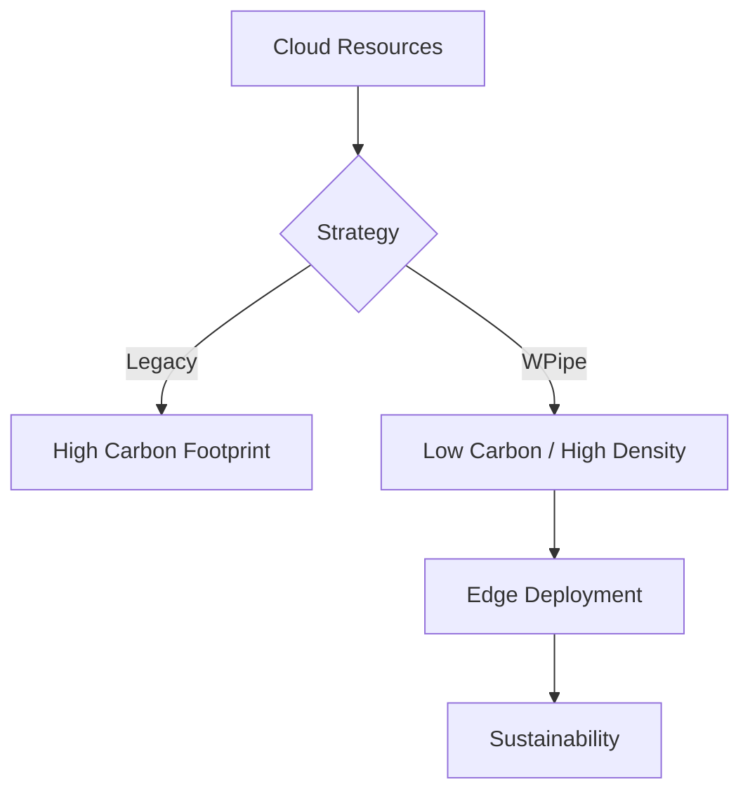

# WPipe: Mastery of Green-IT on DZ (Post 258)

## Sustainable Software: WPipe and Green-IT
Reduce your carbon footprint by optimizing RAM and CPU usage. Every byte counts.

### Visualization


### ⚔️ Battle Card

| Feature | WPipe | Airflow | n8n | Celery | Prefect | Zapier/Make |
| :--- | :---: | :---: | :---: | :---: | :---: | :---: |
| **Memory Footprint** | < 50MB | > 2GB | > 500MB | > 200MB | > 500MB | Cloud / High |
| **Configuration** | Pure Python | Python/YAML | Visual UI | Python/Broker | Python | Visual UI |
| **Resilience** | SQLite Checkpoints | Postgres/DB | Database | Redis/RabbitMQ | Cloud/DB | None (Manual) |
| **Setup Time** | < 1 min | Hours | Minutes | Hours | Minutes | Minutes |
| **Cost** | Free/OSS | OSS (High Infra) | OSS/Paid | OSS (Infra) | OSS/Cloud | Per Execution |
| **Learning Curve** | Low (Pythonic) | High | Medium | High | Medium | Low |
| **Self-Documentation** | Mermaid Built-in | Graph UI | Node UI | None | Graph UI | Node UI |

## Key Metrics
- **+117k downloads**: A community that values efficiency.
- **<50MB RAM**: Perfect for Green-IT and edge computing.
- **SQLite WAL Checkpoints**: Industrial-grade resilience without the overhead.

### Pythonic Implementation
```python
from wpipe import step as state

@state(name='master_step', timeout=60)
def logic(context):
    # Implementation of Green-IT
    return {'status': 'success'}
```

## Architectural Deep Dive

## Conclusion
WPipe is the final piece of your Green-IT strategy. Join the movement today.
