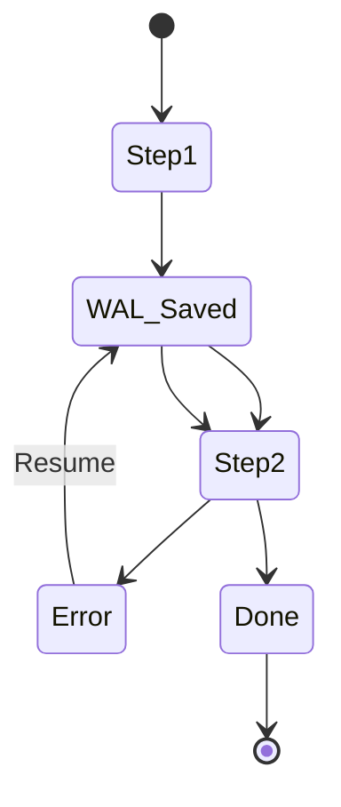

# High-Resilience Task Orchestration: What 117k Users Taught Us About Failure

Scale is not just about size. It is about resilience — how gracefully your system fails and how fast it recovers. A pipeline that can process a million rows but loses everything on one crash has negative scale.

## The Naive Script: Start From Zero

Every developer has written the script that works — until it doesn't:

```python
results = []
for item in items:
    result = process(item)   # crash here after 3 hours
    results.append(result)   # this never happens for the rest
```

One crash and you're re-processing hours of work. The exponential amplification: the longer the job, the more painful the restart.

## The Checkpoint Pattern

Resilience starts with checkpointing: persist the *position* so a restart continues from the last successful state instead of the beginning.

wpipe implements this with SQLite's Write-Ahead Logging (WAL). The pipeline's state is stored as it executes — each step's produced context is committed before the next step starts.

```python
from wpipe import Pipeline, step

@step(name="phase1", retry_count=3, retry_delay=2)
def phase1(data):
    return {"phase1_complete": data["input"] + 1}

@step(name="phase2")
def phase2(data):
    return {"phase2_complete": data["phase1_complete"] * 2}

pipe = Pipeline(pipeline_name="resilient", tracking_db="resilient.db")
pipe.set_steps([phase1, phase2])
pipe.run({"input": 1})

# If phase2 fails and you re-run: phase1 loads from the checkpoint,
# it does NOT re-execute.
```

Why WAL matters here:

- **Crash safety**: committed state survives power loss.
- **No external services**: the whole checkpointing lives in a local `.db` file.
- **Atomic checkpoints**: each step commit is all-or-nothing.

## Failure As a First-Class Concern

| Strategy | Typical script | wpipe |
| :--- | :--- | :--- |
| On failure | Restart from step 0 | Resume from checkpoint |
| Retry policy | Manual re-run | `retry_count` / `retry_delay` |
| History | Console scrollback | Tracker SQL |
| RAM footprint | Depends on data | <50MB steady |



## The +117k User Learnings

The community around wpipe reinforced one principle: **resilience must be free by default**. You shouldn't have to configure a database, wire retry middleware, or write a state machine to get crash recovery. It should be the baseline behavior, so that even a 20-line ETL script behaves like production infrastructure.

That's why the default profile gives you checkpoints, retries, and tracing out of the box. And that's the bar every orchestrator should be measured against.

#wpipe #Resilience #Python #Programming #Reliability