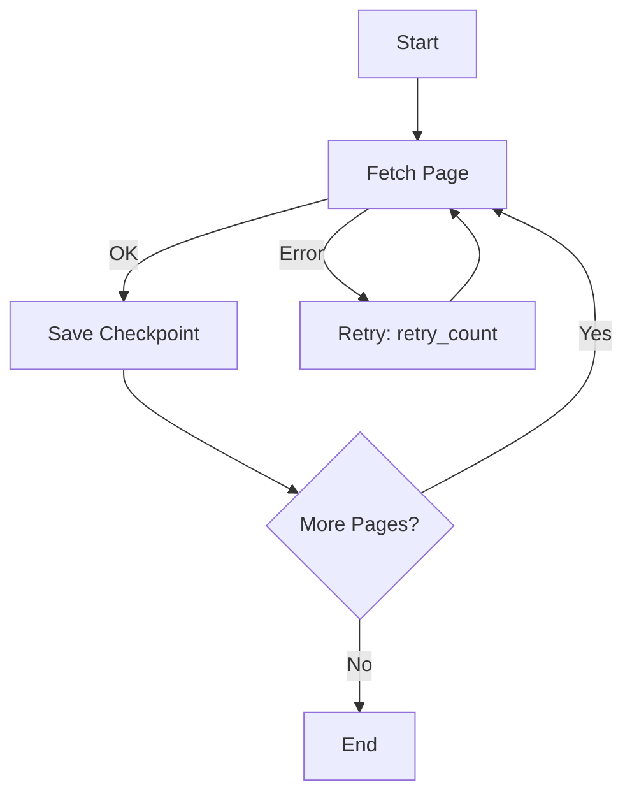

# Scraping That Resumes: Why Your Crawler Needs a Save Game

Web scraping is the most fragile category of software. Target sites change HTML weekly, rate-limit aggressively, and drop connections without warning. If your scraper has no state, every one of these failures means restarting from page one.

You've lived it: six hours of crawling, page 987 of 1500, the WiFi blinks, and your script dies. Restart. Six more hours. This time the target blocks you at page 400. Restart. The scraper has become a full-time job.

## The Missing Feature: Resume

What scrapers need is what video games mastered decades ago: a **save state** that lets you continue exactly where you stopped.

## Checkpointing the Crawl

A resumable scraper persists its position as it advances. wpipe gives this out of the box via SQLite WAL checkpoints — the produced context of each step is committed before the next step begins.

```python
from wpipe import Pipeline, step

@step(name="list_pages", retry_count=3, retry_delay=5)
def list_pages(data):
    return {"pages": build_page_list(data["base_url"], data["n"])}

@step(name="crawl_page", retry_count=2, retry_delay=2)
def crawl_page(data):
    page = fetch(data["url"])       # may raise / time out
    return {"content": extract(page)}

pipe = Pipeline(pipeline_name="crawler", tracking_db="crawl.db")
pipe.set_steps([list_pages, crawl_page])
pipe.run({"base_url": "https://example.com", "n": 1500})
```

The behavior difference:

- **No wpipe**: crash at page 987 → re-crawl 987 pages.
- **With wpipe**: crash at page 987 → resume at page 987.

Combined with `retry_count` / `retry_delay`, transient failures (rate limit, TCP reset, 5xx) are absorbed automatically instead of killing the run.

## Battle Card: Script vs. Resumable Pipeline

| Scenario | Plain script | wpipe pipeline |
| :--- | :--- | :--- |
| Page 500 fails at 02:00 | Restart from 0 | Retry up to N times |
| Site down for 1 hour | Progress lost | Waits/resumes |
| Power dip at page 1300 | Progress lost | Resume from last checkpoint |
| Memory | Grows with data | <50MB steady |



## Conclusion

A scraper without checkpoints isn't a scraper — it's a gamble. Making state persistence the default means your crawler behaves predictably in production: transparent, auditable (tracker SQL), and green (local SQLite, no extra servers).

> Your scraper should outlast your coffee, not your luck.

#WebScraping #Python #wpipe #DataEngineering #Reliability