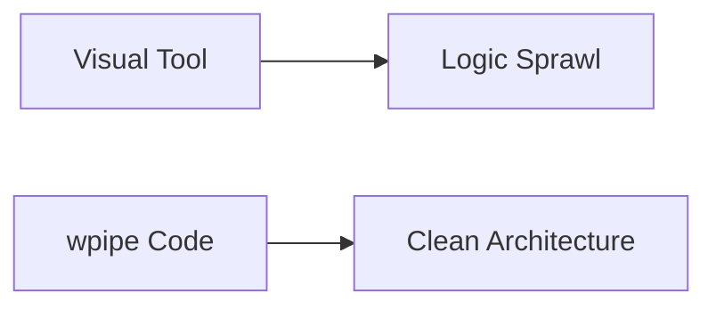

# Stop Clicking, Start Coding: Why Your Pipelines Belong in Git

Every automation platform eventually hits the same wall. The visual canvas is delightful at ten nodes. At fifty nodes with branches, retries and error paths, the canvas becomes a rat's nest of arrows, and the only way to understand it is to zoom out and pray.

Welcome to the visual trap.

## The Visual Trap

Visual builders optimize for the first five minutes — drag, drop, connect, voilà. They optimize against you from minute six onward:

- **No real version control**: your workflow lives in a proprietary database, not in a `diff`.
- **No code-level testing**: you can't unit-test a node graph in CI.
- **Opaque debugging**: when a run fails, you inspect a UI, not a traceback.
- **Logic sprawl**: business rules end up entangled with UI state, screenshots, and accidental clicks.

## The Code-First Way

Code is the ultimate source of truth. It can be:

- **Reviewed** in pull requests.
- **Tested** with `pytest`.
- **Audited** with `git log` and `git blame`.
- **Debugged** with the tools Python already has: tracebacks, PDB, logging.

wpipe is a code-first orchestrator. Your pipeline is Python, full stop.

```python
from wpipe import Pipeline, step

@step(name="normalize", retry_count=2)
def normalize(data):
    return {"clean": data["raw"].strip().lower()}

@step(name="load")
def load(data):
    save(data["clean"])   # it's just Python
    return {"loaded": True}

pipe = Pipeline(pipeline_name="code_first")
pipe.set_steps([normalize, load])
pipe.run({"raw": "  HELLO  "})
```

## Battle Card

| Attribute | wpipe (code-first) | Drag-and-drop UI |
| :--- | :--- | :--- |
| Version control | Git-native | Proprietary DB |
| Testing | `pytest` | Manual |
| Debugging | Traceback / PDB | Opaque |
| Flexibility | Any Python | Limited by UI |
| Business logic | In your repo | In their cloud |
| Community signal | +117k downloads | N/A |



## The Compromise That Isn't

Some platforms offer "git-sync" of their visual definitions. That's not code-first; that's a serialization of a UI. The moment you need a loop, a dynamic branch, or integration with an obscure library, a code-first pipeline does it — no feature request, no wait for a checkbox.

## Conclusion

Your automation is software. Treat it like software: version it, test it, review it, and keep it in your repository where it can't rot. That's the manifesto that +117k wpipe downloads say developers are voting for.

> Clicking is a demo. Coding is the product.

#Programming #CleanCode #wpipe #Python #CodeFirst #DeveloperExperience