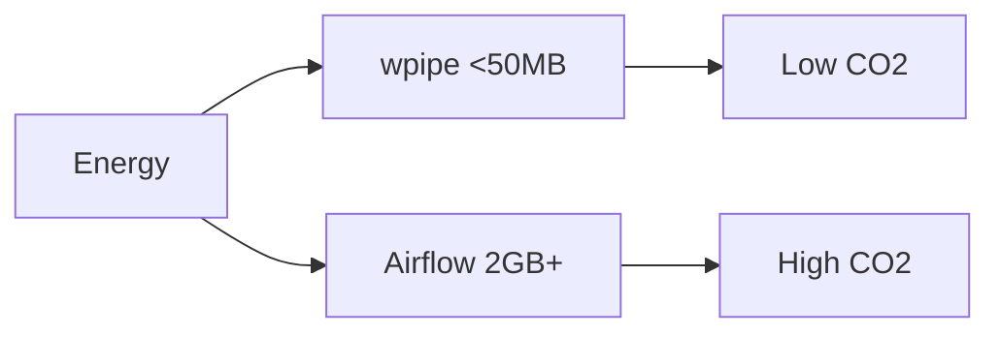

# RAM Efficiency Is a Climate Decision

When engineers estimate the carbon footprint of a service, they usually count servers, network, and power — not megabytes. But memory is energy: holding a process resident costs power per second, and expanding RAM headroom means more hardware or more cloud instances. In the aggregate, RAM efficiency is a climate decision.

## Why Orchestrators Are Memory Hogs

Traditional orchestrators assume that infrastructure is cheap. Their architecture reflects it: a scheduler daemon, a metadata database, a message broker, worker pools, and a web UI. Each of those is a resident process. The footprint piles up:

- Airflow's scheduler + Postgres + workers commonly exceeds **2GB**.
- Prefect and Dagster with server + databases: **500MB+**.
- n8n in a container: **500MB+**.
- Celery + RabbitMQ/Redis: **200MB+**.

For orchestration that, at the end of the day, runs a few Python functions.

## The wpipe Profile

wpipe is built on a different premise: the orchestrator should be *part of* your process, not a fleet of extra processes.

- **<50MB RAM** steady-state for a running pipeline.
- **No broker** — state lives in a local SQLite file (WAL mode).
- **No scheduler daemon** — run the pipeline where and when you need it.

```python
from wpipe import Pipeline, step

@step(name="transform")
def transform(data):
    return {"value": data["x"] * 2}

pipe = Pipeline(pipeline_name="low_ram")
pipe.set_steps([transform])
pipe.run({"x": 21})
# This pipeline holds a fraction of the RAM of a single Airflow worker.
```

## Battle Card

| Feature | wpipe | Airflow | Prefect | n8n | Celery |
| :--- | :---: | :---: | :---: | :---: | :---: |
| RAM footprint | <50MB | 2GB+ | 500MB+ | 500MB+ | 200MB+ |
| Broker needed | No | No | No | No | Yes (Redis/Rabbit) |
| DB server | No (SQLite) | Postgres | Postgres/Cloud | DB | Redis |
| Extra processes | None | Scheduler+workers | Server+agent | Container | Broker+workers |



## The Green-IT Payoff

Every production machine running wpipe instead of a heavy stack:

1. Frees RAM for the actual workload (or allows a smaller instance).
2. Reduces the number of always-on processes.
3. Cuts idle energy — because there's almost nothing idle to burn.

Measured at fleet scale, that's a real reduction in power draw and the cloud bill that follows it.

## Conclusion

When the difference between orchestrators is measured in gigabytes, the lighter one is also the greener one. Choosing the <50MB option is choosing to buy exactly the compute you need — and no more.

> The cheapest, cleanest memory is the memory your software never allocates.

#GreenIT #Sustainability #wpipe #Python #Efficiency