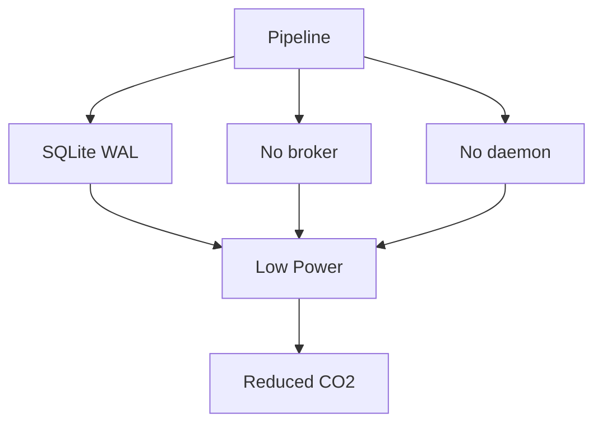

# Reducing CO2: The Carbon Math of Your Orchestrator

Sustainable coding sounds abstract until you run the numbers. Every watt your software consumes is watts the data center must provision, cool, and bill for. An orchestrator that burns 2GB of RAM across an always-on fleet isn't a placeholder cost — it's a carbon budget with a monthly draw.

## The Carbon Math, Simplified

A rough mental model:

`CO2 ≈ Power draw × Time`

Power draw is driven by what stays resident and what gets executed. Pipelines that sit on schedulers, brokers, and metadata databases are **permanently consuming**, even when no job runs. That idle draw is pure waste: compute that produces nothing.

## Where wpipe Cuts the Burn

- **No idle fleet**: no daemon, broker, or scheduler sitting resident 24/7.
- **<50MB RAM**: a fraction of the resident footprint of heavy platforms.
- **SQLite WAL instead of a DB server**: the smallest possible state layer, local and low-power.
- **Runs on already-existing hardware**: desktops, VMs, Pis — no dedicated infra required.

```python
from wpipe import Pipeline, step

@step(name="etl", retry_count=3)
def etl(data):
    return {"processed": data["rows"]}

pipe = Pipeline(pipeline_name="efficiency", tracking_db="carbon.db")
pipe.set_steps([etl])

# Schedules with cron/CI, not an always-on scheduler daemon.
# pipe.run({"rows": 1000})
```

## Battle Card

| Component | wpipe | Heavy scaffold |
| :--- | :---: | :---: |
| Scheduling | cron / CI, on-demand | Always-on daemon |
| State layer | SQLite local (WAL) | Metadata DB server |
| Broker | None | Redis/RabbitMQ |
| RAM footprint | <50MB | 500MB - 2GB+ |
| Idle energy | ~zero | Constant |



## Doing the Right Thing, Earnestly

Cutting CO2 here isn't marketing — it's arithmetic:

1. **Remove always-on pieces** → the idle power draw disappears.
2. **Shrink the footprint** → smaller instances run the same workload.
3. **Local state** → no extra hardware for the database either.

Each of those is measurable in a cloud bill, and each line item is a small vote for a smaller footprint.

## Conclusion

Efficiency and sustainability are the same engineering decision viewed from two angles. By choosing a pipeline engine whose default profile is minimal, you reduce both your compute spend and your emissions — without reducing a single feature.

> Green-IT is not a feature. It is the property of software that uses only what it needs.

#GreenIT #Sustainability #wpipe #CarbonFootprint #Efficiency