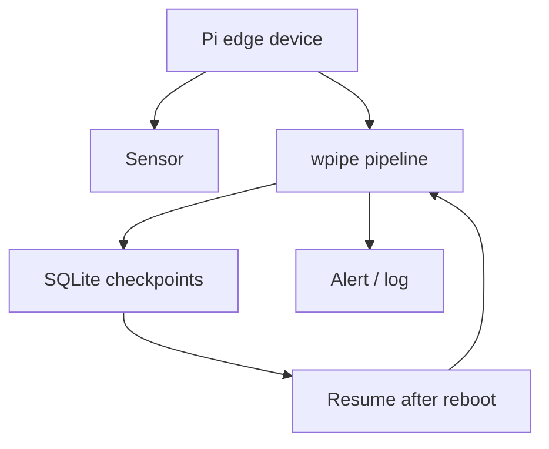

# Raspberry Pi as an Orchestrator: Edge Infrastructure That Fits in a Box

The Raspberry Pi became the symbol of cheap, low-power computing. It's the first board developers reach for when they want edge processing: observability agents, home automation, shop-floor gateways, sensor aggregation. And then reality arrives — most orchestration tooling simply doesn't run there.

## Why Heavy Orchestrators Don't Fit

- Airflow on a Pi: the scheduler + Postgres fight for memory against the actual workload. The Pi has **1-8GB** to share.
- Prefect/Dagster server: same story — a metadata DB and a web service competing with your application.
- Celery: now you need Redis *and* worker processes on a shoestring budget.

The result: developers hand-roll scripts with `while True` loops and pray. That's fragile, unmonitored, and unbusinesslike — but it fits.

## wpipe Fits

wpipe's design was shaped by exactly this constraint:

- **<50MB RAM** steady-state.
- **Zero external services** — SQLite WAL, local file, no broker.
- **Python-native** — runs wherever Python runs, i.e., everywhere.

```python
from wpipe import Pipeline, step
import time

@step(name="poll", retry_count=3, retry_delay=10)
def poll(data):
    value = read_sensor()
    return {"reading": value}

pipe = Pipeline(pipeline_name="pi_gateway", tracking_db="gateway.db")
pipe.set_steps([poll])
pipe.run({})
```

In production you'd trigger this from cron — same schedule flexibility as a daemon, but with zero always-on footprint.

## Battle Card

| Requirement | Heavy orchestrator | wpipe on Pi |
| :--- | :---: | :---: |
| RAM needed | 500MB - 2GB+ | <50MB |
| External services | Broker + DB | None |
| Crash recovery | Infra-dependent | SQLite WAL checkpoint |
| Fits typical Pi | Usually not | Yes |
| Dashboards | Web service | Optional local dashboard |



## The Edge Bonus

When the pipeline and its state live on the same device, several things improve at once:

- **Latency**: decisions happen locally, not after a cloud round-trip.
- **Privacy**: raw telemetry doesn't have to leave the device.
- **Resilience**: a checkpoint lets it resume after a power blip.
- **Cost**: no cloud egress for data that never needs to cross a network.

## Conclusion

The edge isn't a downgrade of the datacenter — it's a different set of constraints. Software that respects those constraints, like wpipe, turns a $50 board into a real orchestrator: persistent, resumable, and green.

> Power isn't measured in cores. It's measured in work per watt.

#RaspberryPi #EdgeComputing #GreenIT #wpipe #IoT #Python