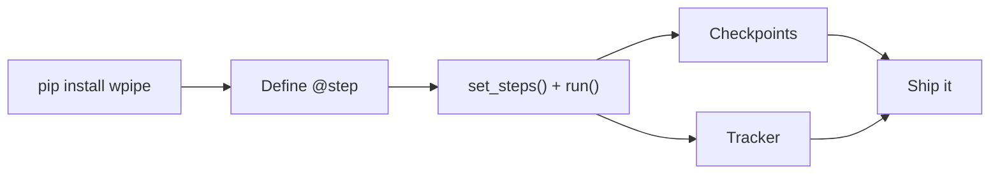

# Lightweight Pipelines: The Architecture That Ships Fast

Every orchestrator promises power. Very few promise lightness, and that's a tragedy — because lightness is what lets software ship quickly and run anywhere.

## The Weight Accumulator

Heavy orchestration stacks accumulate weight compoundingly:

1. **Setup activation energy**: install the broker, create the database, spin the workers, configure the UI. Days, not minutes.
2. **Per-change friction**: a logic tweak becomes a deploy cycle through the orchestration platform.
3. **Per-instance weight**: every environment (dev, staging, prod, edge) needs the whole scaffold.

Each layer of weight compounds into the next, until the platform is more work than the pipelines it runs.

## wpipe: Maliciously Light

wpipe counters each of those:

- **One install**: `pip install wpipe`. Set of steps → `run()`. No broker, no DB server.
- **Code-is-config**: changes are Python diffs, tested and reviewed like any code.
- **Fits any environment**: the same library that runs in a container also runs on a Pi.

```python
from wpipe import Pipeline, step

@step(name="ingest", retry_count=2)
def ingest(data):
    return {"rows": data["raw"]}

@step(name="validate")
def validate(data):
    return {"valid": len(data["rows"]) > 0}

pipe = Pipeline(pipeline_name="light")
pipe.set_steps([ingest, validate])
pipe.run({"raw": [...]})

# Environment #2, production: same code, same library. Done.
```

## Battle Card

| Dimension | Heavy stack | wpipe light profile |
| :--- | :--- | :--- |
| Time-to-first-pipeline | Hours-days | Minutes |
| Moving parts | Scheduler+broker+DB+UI | One library |
| RAM footprint | 500MB - 2GB+ | <50MB |
| Portability | Container choreography | Any Python runtime |
| Change cycle | Platform deploys | Git + pip |



## Light Isn't Weak

There's a false trade-off that "production-grade" means heavy. wpipe shows resilience can be cheap:

- `retry_count` / `retry_delay` on any step.
- `@timeout_sync(seconds=...)` for runaway executions.
- SQLite WAL checkpoints so a crash resumes, not restarts.
- `Parallel(steps=[...])` with `use_processes=True` and `Background` threads when you need concurrency.

The power is there — it just doesn't require the extra fleet to deliver it.

## Conclusion

Lightness is an architecture decision, not an accident. Choosing the smallest orchestrator that does the job means faster setup, faster iteration, and a smaller carbon footprint. That's how pipelines ship fast and stay fast.

> A pipeline platform should feel like a library, not an ecosystem.

#Lightweight #Python #wpipe #Microservices #GreenIT