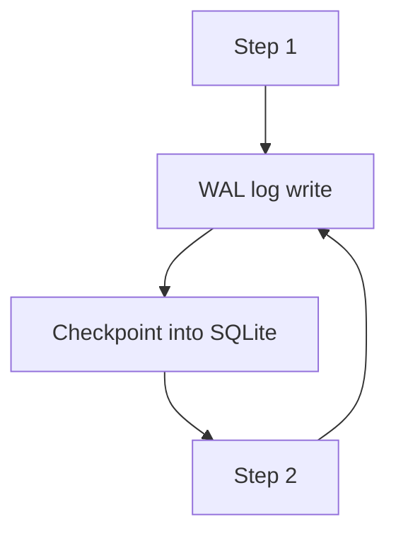

# Eco-Friendly State: Why SQLite (Not a DB Server) Is the Green Choice

"Production-grade" is frequently interpreted as "a database server running somewhere." Postgres here, Redis there, a metadata DB over yonder. For an orchestrator, that's a large assumption — because a database server is a permanently-resident, energy-consuming process that exists to store a little state.

## The State Problem

Pipelines need state:

- Where did the last successful step finish?
- What did the previous step produce?
- What has already run, and how long did it take?

Heavy orchestrators answer with centralized databases. The cost: a resident server, replication, backups, connections, and — quietly — constant energy. All to store what is, at heart, a checkpoint table and a log.

## Enter SQLite WAL

SQLite organizes its journaling with **Write-Ahead Logging (WAL)**: writes go to a separate log file and get checkpointed into the main database. For an orchestrator that commits state step-by-step, WAL is ideal:

- **Atomic commits**: each step's state is durable all-or-nothing.
- **Crash safety**: committed state survives power loss.
- **Zero administration**: a local `.db` file, no server, no connection pool.

```python
from wpipe import Pipeline, step

@step(name="sync", retry_count=3)
def sync(data):
    return {"synced": data["rows"]}

pipe = Pipeline(pipeline_name="state", tracking_db="pipeline.db")
pipe.set_steps([sync])
pipe.run({"rows": 1000})
```

The `.db` file **is** the orchestrator's database. One file, one process, green by construction.

## Battle Card

| Aspect | DB server | SQLite WAL in wpipe |
| :--- | :--- | :--- |
| Processes alive | 1+ resident servers | None (in-process) |
| RAM | Shared buffers, 100MB+ | Part of <50MB total |
| Admin | Users, backups, replication | Copy the file |
| Crash consistency | Depends on tuning | WAL gives it by default |
| Power draw | Constant | Negligible |



## What You Actually Lose (Nothing)

The common worry is "SQLite isn't for production." That's true when you need multi-user concurrency at scale. A pipeline's state needs:

- One writer at a time (the pipeline).
- Atomic commits (WAL).
- Durability (WAL).
- A queryable history (tracker).

SQLite provides all four. The scale that "kills" SQLite is precisely the scale a single pipeline never reaches.

## Conclusion

Choosing SQLite WAL over a database server isn't a compromise — it's an upgrade on the axis that matters for orchestration: less infrastructure, same durability, and a drastically smaller environmental bill.

> The greenest database is the one you never have to run as a service.

#SQLite #GreenIT #wpipe #Python #Sustainability