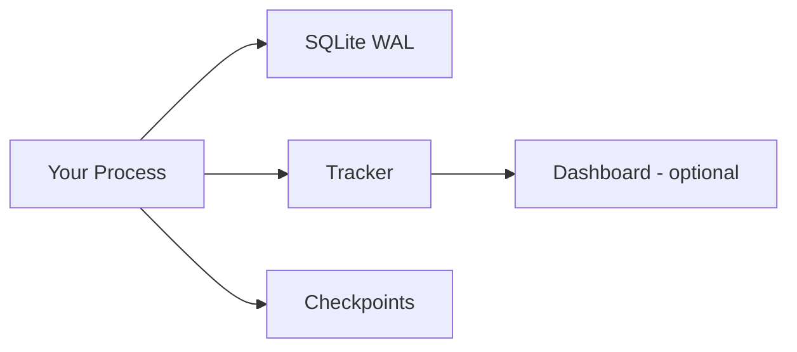

# Minimal Infrastructure: The Anti-Scaffold Architecture

There is a pattern in our industry where every software problem gets solved by adding a component. Need jobs? Add a scheduler. Need state? Add a database. Need messaging? Add a broker. Before long, the scaffolding around your pipeline is more complex than the pipeline itself — and every component is another thing to deploy, patch, monitor, and pay for.

## The Scaffold Trap

The classic orchestrator stack reads like a shopping list:

- A scheduler daemon.
- A metadata database (Postgres/MySQL/Cloud DB).
- A message broker (Redis/RabbitMQ) for task distribution.
- Worker processes/containers.
- A web UI + its static assets.
- A metrics pipeline to babysit all of the above.

At least **six moving parts** whose only job is to run some Python functions.

## Minimal Infrastructure Means Fewer Failures

Every component is a failure mode. The fewer pieces that must be alive for your pipeline to work, the fewer ways it can break, and the faster it can be deployed anywhere.

wpipe's "minimal infra" profile:

- **One process**: your own.
- **One state layer**: a SQLite file (WAL mode).
- **Zero brokers, zero daemons, zero databases-to-admin.**

```python
from wpipe import Pipeline, step

@step(name="process", retry_count=2)
def process(data):
    return {"result": data["row"] * 10}

pipe = Pipeline(pipeline_name="minimal", tracking_db="minimal.db")
pipe.set_steps([process])
pipe.run({"row": 1})
```

## Battle Card

| Component | Classic scaffold | wpipe |
| :--- | :---: | :---: |
| Scheduler daemon | Yes | No (cron/CI) |
| Metadata DB server | Yes | No (SQLite) |
| Broker | Yes | No |
| Worker pool | Yes | In-process |
| Web UI | Required | Optional local dashboard |
| RAM footprint | 500MB - 2GB+ | <50MB |



## What "Without Scaffolding" Unlocks

- **Portability**: the same code runs in a container, a VM, a Raspberry Pi, or a cronjob — with zero infrastructure migration.
- **Speed of change**: logic is a Python diff, not a platform release.
- **Cost**: your bill is the compute your pipeline actually uses.

## Conclusion

We should stop judging pipelines by how much infra surrounds them and start judging them by the work they do. Minimal infrastructure isn't primitive — it's the most resilient architecture there is, because there's almost nothing left to go wrong.

#Minimalism #Infrastructure #wpipe #Python #SoftwareArchitecture