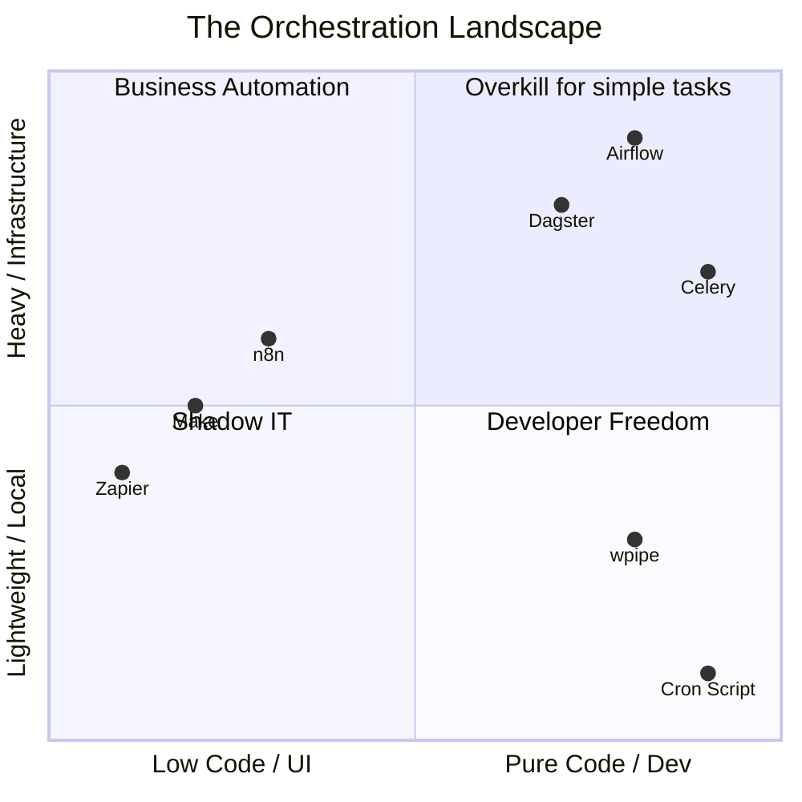

# 🌌 The Orchestration Spectrum: Where does your stack belong?

**Headline: Is Airflow too much? Is n8n too little? Let's talk about the elephant in the orchestration room. 🐘🐍**

Over the past few months, I've analyzed how data engineers and backend developers automate their processes. The market is split between two polarized extremes:

🔴 **Extreme 1: "The Visual Toys" (Zapier, Make, n8n)**
Great for marketing and prototypes. But the day you need to version your logic in Git, run a complex loop, or use `pandas`, they become a prison of JSONs and "black boxes."

🔴 **Extreme 2: "The Infrastructure Monsters" (Airflow, Dagster, Celery)**
Powerful. Industrial. But they require spinning up containers, managing message brokers (Redis/RabbitMQ), and writing tons of *boilerplate* just to run a 100-line script.

And then there's the "old reliable": **The Cron script**. (Which, as we all know, fails silently at 3 AM 😅).

### 🟢 The Balance Point: Introducing wpipe

I designed **wpipe** to fill exactly that gap in the Python ecosystem.

### Why does wpipe sit in the "Developer Freedom" quadrant?

1. **Python-First & Git-Friendly:** No dragging boxes. Define your flows in YAML or pure Python.
2. **Zero Infrastructure:** No Docker or Redis needed. It works with a `pip install`.
3. **Automatic Resilience (Checkpoints):** wpipe saves your data state in **SQLite** step by step.
4. **Industrial-Grade Tracking:** Execution history saved automatically, no external servers to configure.

You don't need a Kubernetes cluster to orchestrate your data. And you definitely shouldn't trust a stateless script.

👇 **Look at the chart. Which quadrant is your team suffering in right now? I read the comments.**

#Python #DataEngineering #Airflow #n8n #SoftwareArchitecture #wpipe #OpenSource