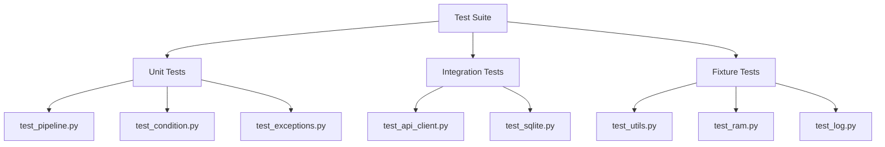
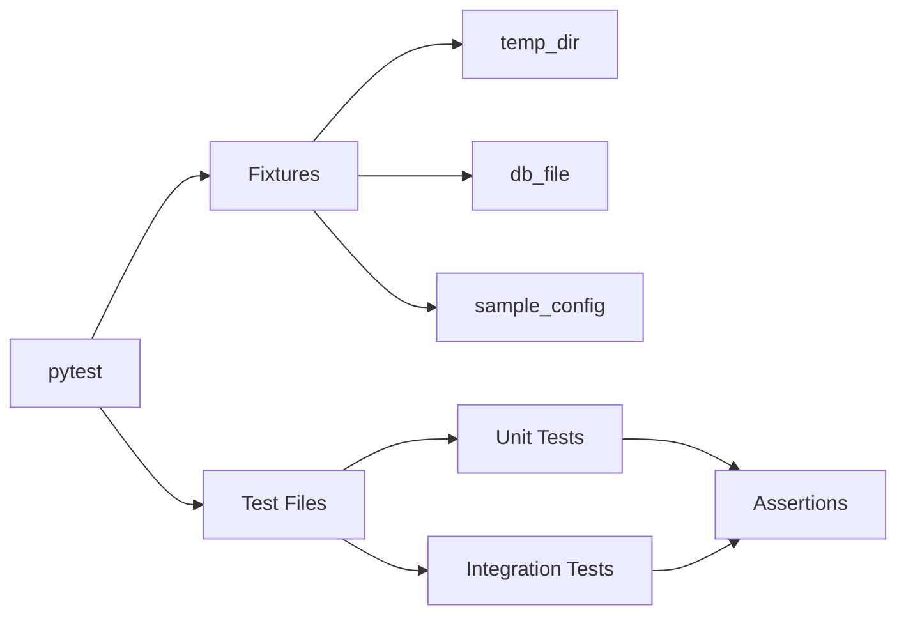
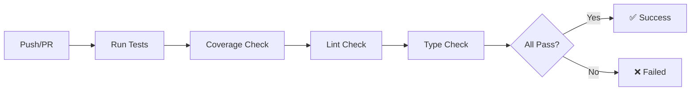

# wpipe Test Suite

<!-- Logo placeholder -->
<!-- ┌─────────────────┐ -->
<!-- │    wpipe        │ -->
<!-- │   Testing ⚙️    │ -->
<!-- └─────────────────┘ -->

This directory contains the comprehensive test suite for the wpipe library with 106 tests covering all functionality.

## Project Overview

The test suite ensures reliability and correctness of all wpipe components through systematic testing including unit tests, integration tests, and fixture-based testing.

---

## Test Coverage



---

## Test Files

| File | Coverage | Description |
|------|----------|-------------|
| `conftest.py` | Fixtures | Shared pytest fixtures and configuration |
| `test_pipeline.py` | Pipeline | Tests for Pipeline class core functionality |
| `test_condition.py` | Conditions | Tests for Condition class |
| `test_api_client.py` | API | Tests for APIClient class |
| `test_sqlite.py` | SQLite | Tests for SQLite database functionality |
| `test_exceptions.py` | Exceptions | Tests for custom exceptions |
| `test_utils.py` | Utils | Tests for utility functions |
| `test_ram.py` | Memory | Tests for RAM memory utilities |
| `test_log.py` | Logging | Tests for logging functionality |
| `test_retry.py` | Retry | Tests for retry logic |

---

## Test Architecture



---

## Running Tests

### All Tests

```bash
pytest
```

### With Coverage

```bash
pytest --cov=wpipe --cov-report=html
open htmlcov/index.html
```

### Specific Test File

```bash
pytest test/test_pipeline.py -v
```

### Specific Test

```bash
pytest test/test_pipeline.py::test_basic_pipeline -v
```

### With Verbose Output

```bash
pytest -v
```

### Stop on First Failure

```bash
pytest -x
```

### Run Tests by Pattern

```bash
pytest -k "test_condition"
```

---

## Fixtures

Available fixtures in `conftest.py`:

| Fixture | Type | Description |
|---------|------|-------------|
| `temp_dir` | `py.path.local` | Temporary directory for test files |
| `db_file` | `str` | Temporary database file path |
| `sample_config` | `dict` | Sample API configuration |
| `sample_pipeline_data` | `dict` | Sample pipeline input data |
| `sample_steps` | `list` | Sample pipeline steps definition |
| `sample_worker_data` | `dict` | Sample worker registration data |
| `yaml_config_file` | `str` | Temporary YAML config file path |

---

## Test Structure Example

```python
import pytest
from wpipe import Pipeline

class TestPipeline:
    """Test suite for Pipeline class."""
    
    def test_basic_pipeline(self, sample_steps):
        """Test basic pipeline execution."""
        pipeline = Pipeline()
        pipeline.set_steps(sample_steps)
        result = pipeline.run({})
        assert result is not None
    
    def test_pipeline_with_data(self, sample_pipeline_data):
        """Test pipeline with input data."""
        pipeline = Pipeline()
        result = pipeline.run(sample_pipeline_data)
        assert isinstance(result, dict)
```

---

## Code Quality Metrics

| Metric | Value |
|--------|-------|
| Total Tests | 106 passing |
| Coverage | Comprehensive |
| Type Hints | Complete |
| Python Support | 3.9, 3.10, 3.11, 3.12, 3.13 |

---

## Linting & Type Checking

```bash
# Lint
ruff check wpipe/

# Auto-fix linting
ruff check wpipe/ --fix

# Type check
mypy wpipe/
```

---

## CI/CD Pipeline



Tests run automatically on:
- Every push to main
- Every pull request

View CI status at: https://github.com/wisrovi/wpipe/actions

---

## Best Practices

### Writing Tests

1. **Use descriptive names**: `test_pipeline_executes_steps_in_order`
2. **One assertion per test**: Easier debugging
3. **Use fixtures**: Share common setup
4. **Mock external calls**: Don't rely on external services
5. **Test edge cases**: Empty data, errors, boundaries

### Running Tests

1. **Run all tests before commit**: `pytest`
2. **Run related tests**: `pytest -k "condition"`
3. **Check coverage**: `pytest --cov=wpipe --cov-report=term-missing`

---

## Documentation

For more information:
- Main README: [../README.md](../README.md)
- Full Docs: https://wpipe.readthedocs.io/
- Examples: [../examples/](../examples/)
